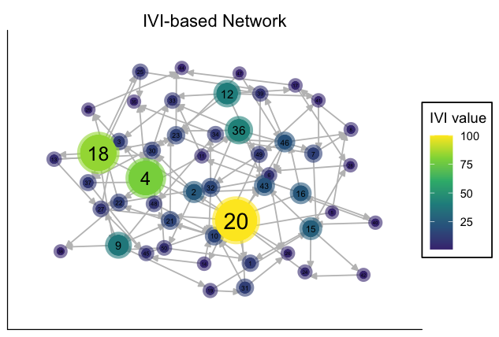
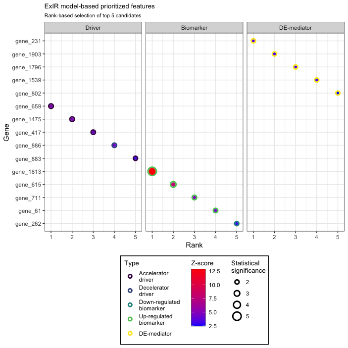

# Introduction to influential

## Overview

`influential` is an R package for identifying influential nodes in
networks and for classifying and prioritizing candidate features from
experimental data. Its functionality spans network construction,
centrality analysis, influence ranking, and experimental data-driven
feature prioritization.


**In brief:** `influential` brings network reconstruction, centrality
analysis, influence modelling, and experimental feature prioritization
into a single workflow, with dedicated methods such as IVI, SIRIR, and
ExIR.

### Package workflows

The main functionality can be grouped into five complementary workflows:

[1Association analysisCalculate fast pairwise correlations, mutual
ranks, p-values, and adjusted p-values before network
reconstruction.](#fast-correlation-analysis)

[2Network reconstructionBuild igraph networks from data frames,
adjacency matrices, incidence matrices, or SIF
files.](#network-reconstruction)

[3Centrality analysisQuantify local, semi-local, and global aspects of
node topology using multiple centrality
measures.](#calculation-of-centrality-measures)

[4Centrality associationAssess dependence, non-linearity,
non-monotonicity, and conditional relationships among continuous
measures.](#assessment-of-the-association-of-centrality-measures)

[5Feature prioritizationIntegrate experimental evidence and network
influence to classify and rank candidate features with ExIR.](#ExIR)

### Featured methods

If you want to move directly to the package’s main integrative methods,
use the shortcuts below:

[Experimental dataExIRClassify and prioritize candidate drivers,
biomarkers, and mediators from experimental omics data.](#ExIR)

[Network influenceIVIIntegrate complementary centrality dimensions to
identify the most influential network nodes.](#IVI)

[Local topologyHubness scoreQuantify the power of a node within its
local network environment.](#HubnessScore)

[Information spreadSpreading scorePrioritize nodes with high potential
to spread information through a network.](#SpreadingScore)

[SimulationSIRIRRank nodes by their effect on network topology and
information spread using SIR-based simulations.](#SIRIR)

[PerturbationComputational manipulationSimulate feature knockout or
up-regulation and assess the resulting network-level
effects.](#CompManipulate)

**Suggested route:** For network-focused analyses, start with
association analysis and network reconstruction, inspect centrality
measures, and then use IVI or related influence scores. For experimental
omics prioritization, you can move directly to [ExIR](#ExIR).

Interactive package explorer

#### Explore the influential toolkit before choosing a workflow

The **influential Feature Explorer** provides a visual, interactive
overview of the package’s capabilities and helps you identify the
methods most relevant to your analysis, including network
reconstruction, IVI, Hubness score, Spreading score, SIRIR, ExIR,
visualization, and computational perturbation.

[**Open Feature Explorer ↗**](https://asalavaty.com/widgets/influential)

``` r

library(influential)
```

## Fast correlation analysis

**Purpose:** efficiently quantify pairwise association before network
reconstruction, with optional mutual rank and significance statistics.

Correlation (association/similarity/dissimilarity) analysis is the first
required step before network reconstructions. Although the base R
[`cor()`](https://rdrr.io/r/stats/cor.html) function makes it possible
to perform correlation analysis of a table, this function is notably
slow in the correlation analysis of large datasets. Also, calculation of
probability values is not possible for all correlations between all
pairs of features simultaneously. The `fcor` function calculates
Pearson/Spearman correlations between all pairs of features in a
matrix/data frame much faster than the base R cor function. It is also
possible to simultaneously calculate mutual rank (MR) of correlations as
well as their p-values and adjusted p-values. Additionally, this
function can automatically combine and flatten the result matrices.
Selecting correlated features using an MR-based threshold rather than
based on their correlation coefficients or an arbitrary p-value is more
efficient and accurate in inferring functional associations in systems,
for example in gene regulatory networks.

Here is an example of performing correlation analysis using the `fcor`
function.

``` r


# Prepare a sample dataset
set.seed(60)
my_data <- matrix(data = runif(n = 10000, min = 2, max = 300), 
                       nrow = 50, ncol = 200, 
                       dimnames = list(c(paste("sample", c(1:50), sep = "_")), 
                                       c(paste("gene", c(1:200), sep = "_")))
)
```

Have a look at top 5 samples and gene (rows and columns) of the
`my_data`:

|          |    gene_1 |    gene_2 |    gene_3 |    gene_4 |    gene_5 |
|:---------|----------:|----------:|----------:|----------:|----------:|
| sample_1 | 229.80194 | 202.09477 | 286.98031 | 212.86299 | 255.15716 |
| sample_2 | 107.12704 | 262.56776 |  92.47135 | 263.67454 | 188.00376 |
| sample_3 | 208.04590 | 123.99512 | 284.35705 | 173.80360 | 270.60758 |
| sample_4 | 209.36913 | 141.90713 | 154.59261 | 130.17074 | 219.54511 |
| sample_5 |  86.21945 |  14.10478 | 258.05186 |  40.89961 |  18.83074 |

``` r


# Calculate correlations between all pairs of genes

correlation_tbl <- fcor(data = my_data, 
                        method = "spearman", 
                        mutualRank = TRUE,
                        pvalue = "TRUE", adjust = "BH",
                        flat = TRUE)
```

Now have a look at the top 10 rows of the `correlation_tbl`:

| row    | column |        cor |         mr |         p |     p.adj |
|:-------|:-------|-----------:|-----------:|----------:|----------:|
| gene_1 | gene_2 |  0.3373349 |   3.872983 | 0.0165899 | 0.8096184 |
| gene_1 | gene_3 |  0.0721729 | 122.270193 | 0.6184265 | 0.9981266 |
| gene_2 | gene_3 |  0.0002401 | 200.000000 | 0.9986797 | 0.9995793 |
| gene_1 | gene_4 | -0.0636255 | 132.864593 | 0.6606863 | 0.9981266 |
| gene_2 | gene_4 |  0.0124370 | 182.931681 | 0.9316877 | 0.9981266 |
| gene_3 | gene_4 | -0.0945498 | 108.958708 | 0.5136765 | 0.9981266 |
| gene_1 | gene_5 | -0.0616086 | 136.167177 | 0.6708188 | 0.9981266 |
| gene_2 | gene_5 | -0.1063625 |  90.862533 | 0.4622400 | 0.9981266 |
| gene_3 | gene_5 |  0.2174790 |  25.922963 | 0.1292321 | 0.9700054 |
| gene_4 | gene_5 |  0.0341417 | 171.499271 | 0.8139135 | 0.9981266 |

[Back to top ↑](#top)

## Network reconstruction

**Input flexibility:** reconstruct networks from edge-list data frames,
adjacency matrices, incidence matrices, or Cytoscape SIF files.

Three functions have been obtained from the `igraph`[^1] R package for
the reconstruction of networks.

### From a data frame

In the data frame the first and second columns should be composed of
source and target nodes.  
A sample appropriate data frame is brought below:

| lncRNA      | Coexpressed.Gene |
|:------------|:-----------------|
| ADAMTS9-AS2 | A2M              |
| ADAMTS9-AS2 | ABCA6            |
| ADAMTS9-AS2 | ABCA8            |
| ADAMTS9-AS2 | ABCA9            |
| ADAMTS9-AS2 | ABI3BP           |
| ADAMTS9-AS2 | AC093110.3       |

This is a co-expression dataset obtained from a paper by Salavaty **et
al**.[^2]

``` r

# Preparing the data
MyData <- coexpression.data

# Reconstructing the graph
My_graph <- graph_from_data_frame(d=MyData)
```

If you look at the class of `My_graph` you should see that it has an
`igraph` class:

``` r

class(My_graph)
#> [1] "igraph"
```

### From an adjacency matrix

A sample appropriate adjacency matrix is brought below:

|           | LINC00891 | LINC00968 | LINC00987 | LINC01506 | MAFG-AS1 | MIR497HG |
|:----------|----------:|----------:|----------:|----------:|---------:|---------:|
| LINC00891 |         0 |         1 |         1 |         0 |        0 |        0 |
| LINC00968 |         0 |         0 |         1 |         0 |        0 |        0 |
| LINC00987 |         0 |         1 |         0 |         0 |        0 |        0 |
| LINC01506 |         0 |         0 |         0 |         0 |        0 |        0 |
| MAFG-AS1  |         0 |         0 |         0 |         0 |        0 |        0 |
| MIR497HG  |         0 |         1 |         1 |         0 |        0 |        0 |

**Note:** An adjacency matrix must have the same number of rows and
columns.

``` r

# Preparing the data
MyData <- coexpression.adjacency        

# Reconstructing the graph
My_graph <- graph_from_adjacency_matrix(MyData)        
```

### From an incidence matrix

A sample appropriate incidence matrix is brought below:

|        | Gene_1 | Gene_2 | Gene_3 | Gene_4 | Gene_5 |
|:-------|-------:|-------:|-------:|-------:|-------:|
| cell_1 |      0 |      1 |      1 |      0 |      1 |
| cell_2 |      1 |      1 |      1 |      0 |      0 |
| cell_3 |      1 |      1 |      1 |      0 |      0 |
| cell_4 |      0 |      0 |      0 |      1 |      0 |

``` r

# Reconstructing the graph
My_graph <- graph_from_adjacency_matrix(MyData)        
```

### From a SIF file

SIF is the common output format of the Cytoscape software.

``` r

# Reconstructing the graph
My_graph <- sif2igraph(Path = "Sample_SIF.sif")        

class(My_graph)
#> [1] "igraph"
```

[Back to top ↑](#top)

## Calculation of centrality measures

**Topology at multiple scales:** inspect local, semi-local, and global
centrality characteristics before moving to integrative influence
ranking.

To calculate the centrality of nodes within a network several different
options are available. The following sections describe how to obtain the
names of network nodes and use different functions to calculate the
centrality of nodes within a network. Although several centrality
functions are provided, we recommend the [IVI](#IVI) for the
identification of the most `influential` nodes within a network.

**Visualization:** Results from the centrality functions below can be
visualized using the [centrality-based network visualization](#NetVis)
workflow.

### Network vertices

Network vertices (nodes) are required in order to calculate their
centrality measures. Thus, before calculation of network centrality
measures we need to obtain the name of required network vertices. To
this end, we use the `V` function, which is obtained from the `igraph`
package. However, you may provide a character vector of the name of your
desired nodes manually.

**Note:** In many centrality functions, all network nodes are assessed
when no vector of desired vertices is supplied.

``` r

# Preparing the data
MyData <- coexpression.data        

# Reconstructing the graph
My_graph <- graph_from_data_frame(MyData)        

# Extracting the vertices
My_graph_vertices <- V(My_graph)        

head(My_graph_vertices)
#> + 6/794 vertices, named, from 775cff6:
#> [1] ADAMTS9-AS2 C8orf34-AS1 CADM3-AS1   FAM83A-AS1  FENDRR      LANCL1-AS1
```

### Degree centrality

Degree centrality is the most commonly used local centrality measure
which could be calculated via the `degree` function obtained from the
`igraph` package.

``` r

# Preparing the data
MyData <- coexpression.data        

# Reconstructing the graph
My_graph <- graph_from_data_frame(MyData)        

# Extracting the vertices
GraphVertices <- V(My_graph)        

# Calculating degree centrality
My_graph_degree <- degree(My_graph, v = GraphVertices, normalized = FALSE) 

head(My_graph_degree)
#> ADAMTS9-AS2 C8orf34-AS1   CADM3-AS1  FAM83A-AS1      FENDRR  LANCL1-AS1 
#>         172         121         168          26         189         176
```

Degree centrality could be also calculated for *directed* graphs via
specifying the `mode` parameter.

### Betweenness centrality

Betweenness centrality, like degree centrality, is one of the most
commonly used centrality measures but is representative of the global
centrality of a node. This centrality metric could also be calculated
using a function obtained from the `igraph` package.

``` r

# Preparing the data
MyData <- coexpression.data        

# Reconstructing the graph
My_graph <- graph_from_data_frame(MyData)        

# Extracting the vertices
GraphVertices <- V(My_graph)        

# Calculating betweenness centrality
My_graph_betweenness <- betweenness(My_graph, v = GraphVertices,    
                                    directed = FALSE, normalized = FALSE)

head(My_graph_betweenness)
#> ADAMTS9-AS2 C8orf34-AS1   CADM3-AS1  FAM83A-AS1      FENDRR  LANCL1-AS1 
#>   21719.857   28185.199   26946.625    2940.467   33333.369   21830.511
```

Betweenness centrality could be also calculated for *directed* and/or
*weighted* graphs via specifying the `directed` and `weights`
parameters, respectively.

### Neighborhood connectivity

Neighborhood connectivity is one of the other important centrality
measures that reflect the semi-local centrality of a node. This
centrality measure was first represented in a Science paper[^3] in 2002
and is for the first time calculable in R environment via the
`influential` package.

``` r

# Preparing the data
MyData <- coexpression.data        

# Reconstructing the graph
My_graph <- graph_from_data_frame(MyData)        

# Extracting the vertices
GraphVertices <- V(My_graph)        

# Calculating neighborhood connectivity
neighrhood.co <- neighborhood.connectivity(graph = My_graph,    
                                           vertices = GraphVertices,
                                           mode = "all")

head(neighrhood.co)
#>  ADAMTS9-AS2 C8orf34-AS1   CADM3-AS1  FAM83A-AS1      FENDRR  LANCL1-AS1 
#>   11.290698    4.983471    7.970238    3.000000   15.153439   13.465909
```

Neighborhood connectivity could be also calculated for *directed* graphs
via specifying the `mode` parameter.

### H-index

H-index is H-index is another semi-local centrality measure that was
inspired from its application in assessing the impact of researchers and
is for the first time calculable in R environment via the `influential`
package.

``` r

# Preparing the data
MyData <- coexpression.data        

# Reconstructing the graph
My_graph <- graph_from_data_frame(MyData)        

# Extracting the vertices
GraphVertices <- V(My_graph)        

# Calculating H-index
h.index <- h_index(graph = My_graph,    
                   vertices = GraphVertices,
                   mode = "all")

head(h.index)
#> ADAMTS9-AS2 C8orf34-AS1   CADM3-AS1  FAM83A-AS1      FENDRR  LANCL1-AS1 
#>          11           9          11           2          12          12
```

H-index could be also calculated for *directed* graphs via specifying
the `mode` parameter.

### Local H-index

Local H-index (LH-index) is a semi-local centrality measure and an
improved version of H-index centrality that leverages the H-index to the
second order neighbors of a node and is for the first time calculable in
R environment via the `influential` package.

``` r

# Preparing the data
MyData <- coexpression.data        

# Reconstructing the graph
My_graph <- graph_from_data_frame(MyData)        

# Extracting the vertices
GraphVertices <- V(My_graph)        

# Calculating Local H-index
lh.index <- lh_index(graph = My_graph,    
                   vertices = GraphVertices,
                   mode = "all")

head(lh.index)
#> ADAMTS9-AS2 C8orf34-AS1   CADM3-AS1  FAM83A-AS1      FENDRR  LANCL1-AS1 
#>        1165         446         994          34        1289        1265
```

Local H-index could be also calculated for *directed* graphs via
specifying the `mode` parameter.

### Collective Influence

Collective Influence (CI) is a global centrality measure that calculates
the product of the reduced degree (degree - 1) of a node and the total
reduced degree of all nodes at a distance d from the node. This
centrality measure is for the first time provided in an R package.

``` r

# Preparing the data
MyData <- coexpression.data        

# Reconstructing the graph
My_graph <- graph_from_data_frame(MyData)        

# Extracting the vertices
GraphVertices <- V(My_graph)        

# Calculating Collective Influence
ci <- collective.influence(graph = My_graph,    
                          vertices = GraphVertices,
                          mode = "all", d=3)

head(ci)
#> ADAMTS9-AS2 C8orf34-AS1   CADM3-AS1  FAM83A-AS1      FENDRR  LANCL1-AS1 
#>        9918       70560       39078         675       10716        7350
```

Collective Influence could be also calculated for *directed* graphs via
specifying the `mode` parameter.

### ClusterRank

ClusterRank is a local centrality measure that makes a connection
between local and semi-local characteristics of a node and at the same
time removes the negative effects of local clustering.

``` r

# Preparing the data
MyData <- coexpression.data        

# Reconstructing the graph
My_graph <- graph_from_data_frame(MyData)        

# Extracting the vertices
GraphVertices <- V(My_graph)        

# Calculating ClusterRank
cr <- clusterRank(graph = My_graph,    
                  vids = GraphVertices,
                  directed = FALSE, loops = TRUE)

head(cr)
#> ADAMTS9-AS2 C8orf34-AS1   CADM3-AS1  FAM83A-AS1      FENDRR  LANCL1-AS1 
#>   63.459812    5.185675   21.111776    1.280000  135.098278   81.255195
```

ClusterRank could be also calculated for *directed* graphs via
specifying the `directed` parameter.

[Back to top ↑](#top)

## Assessment of the association of centrality measures

**Beyond simple correlation:** assess distributional properties,
dependence, non-linearity, non-monotonicity, and conditional
relationships between continuous measures.

### Conditional probability of deviation from means

The function `cond.prob.analysis` assesses the conditional probability
of deviation of two centrality measures (or any other two continuous
variables) from their corresponding means in opposite directions.

``` r

# Preparing the data
MyData <- centrality.measures        

# Assessing the conditional probability
My.conditional.prob <- cond.prob.analysis(data = MyData,       
                                          nodes.colname = rownames(MyData),
                                          Desired.colname = "BC",
                                          Condition.colname = "NC")

print(My.conditional.prob)
#> $ConditionalProbability
#> [1] 51.61871
#> 
#> $ConditionalProbability_split.half.sample
#> [1] 51.73611
```

- As you can see in the results, the whole data is also randomly split
  into halves in order to further test the validity of conditional
  probability assessments.
- *The higher the conditional probability the more two centrality
  measures behave in contrary manners*.

### Nature of association (considering dependent and independent)

The function `double.cent.assess` could be used to automatically assess
both the distribution mode of centrality measures (two continuous
variables) and the nature of their association. The analyses done
through this formula are as follows:

1.  **Normality assessment**:
    - Variables with **lower than** 5000 observations: *Shapiro-Wilk
      test*
    - Variables with **over** 5000 observations: *Anderson-Darling
      test*  
        
2.  **Assessment of non-linear/non-monotonic correlation**:
    - *Non-linearity assessment*: Fitting a generalized additive model
      (GAM) with integrated smoothness approximations using the `mgcv`
      package  
        
    - *Non-monotonicity assessment*: Comparing the squared coefficients
      of the correlation based on Spearman’s rank correlation analysis
      and ranked regression test with non-linear splines.
      - Squared coefficient of Spearman’s rank correlation **\>**
        R-squared ranked regression with non-linear splines: *Monotonic*
      - Squared coefficient of Spearman’s rank correlation **\<**
        R-squared ranked regression with non-linear splines:
        *Non-monotonic*  
          
3.  **Dependence assessment**:
    - *Hoeffding’s independence test*: Hoeffding’s test of independence
      is a test based on the population measure of deviation from
      independence which computes a D Statistics ranging from -0.5 to 1:
      Greater D values indicate a higher dependence between variables.
    - *Descriptive non-linear non-parametric dependence test*: This
      assessment is based on non-linear non-parametric statistics (NNS)
      which outputs a dependence value ranging from 0 to 1. For further
      details please refer to the NNS R package[^4]: Greater values
      indicate a higher dependence between variables.  
        
4.  **Correlation assessment**: As the correlation between most of the
    centrality measures follows a non-monotonic form, this part of the
    assessment is done based on the NNS statistics which itself
    calculates the correlation based on partial moments and outputs a
    correlation value ranging from -1 to 1. For further details please
    refer to the NNS R package.  
      
5.  **Assessment of conditional probability of deviation from means**
    This step assesses the conditional probability of deviation of two
    centrality measures (or any other two continuous variables) from
    their corresponding means in opposite directions.
    - The independent centrality measure (variable) is considered as the
      condition variable and the other as the desired one.
    - As you will see in the results, the whole data is also randomly
      split into halves in order to further test the validity of
      conditional probability assessments.
    - *The higher the conditional probability the more two centrality
      measures behave in contrary manners*.

``` r

# Preparing the data
MyData <- centrality.measures        

# Association assessment
My.metrics.assessment <- double.cent.assess(data = MyData,       
                                            nodes.colname = rownames(MyData),
                                            dependent.colname = "BC",
                                            independent.colname = "NC")

print(My.metrics.assessment)
#> $Summary_statistics
#>         BC NC
#> Min.              0.000000000                   1.2000
#> 1st Qu.           0.000000000                  66.0000
#> Median            0.000000000                 156.0000
#> Mean              0.005813357                 132.3443
#> 3rd Qu.           0.000340000                 179.3214
#> Max.              0.529464720                 192.0000
#> 
#> $Normality_results
#>                               p.value
#> BC    1.415450e-50
#> NC 9.411737e-30
#> 
#> $Dependent_Normality
#> [1] "Non-normally distributed"
#> 
#> $Independent_Normality
#> [1] "Non-normally distributed"
#> 
#> $GAM_nonlinear.nonmonotonic.results
#>      edf  p-value 
#> 8.992406 0.000000 
#> 
#> $Association_type
#> [1] "nonlinear-nonmonotonic"
#> 
#> $HoeffdingD_Statistic
#>         D_statistic P_value
#> Results  0.01770279   1e-08
#> 
#> $Dependence_Significance
#>                       Hoeffding
#> Results Significantly dependent
#> 
#> $NNS_dep_results
#>         Correlation Dependence
#> Results  -0.7948106  0.8647164
#> 
#> $ConditionalProbability
#> [1] 55.35386
#> 
#> $ConditionalProbability_split.half.sample
#> [1] 55.90331
```

**Regression fallback:** A single regression specification may not fit
every dataset. Depending on the sample size and association structure,
[`double.cent.assess()`](https://asalavaty.github.io/influential/reference/double.cent.assess.md)
may fail during the regression-based step. In that situation, you can
perform the individual assessments manually or use
[`double.cent.assess.noRegression()`](https://asalavaty.github.io/influential/reference/double.cent.assess.noRegression.md),
which avoids the regression test and therefore does not require
dependent and independent variables to be specified.

### Nature of association (without considering dependence direction)

The function `double.cent.assess.noRegression` could be used to
automatically assess both the distribution mode of centrality measures
(two continuous variables) and the nature of their association. The
analyses done through this formula are as follows:

1.  **Normality assessment**:
    - Variables with **lower than** 5000 observations: *Shapiro-Wilk
      test*
    - Variables with **over** 5000 observations: *Anderson–Darling
      test*  
        
2.  **Dependence assessment**:
    - *Hoeffding’s independence test*: Hoeffding’s test of independence
      is a test based on the population measure of deviation from
      independence which computes a D Statistics ranging from -0.5 to 1:
      Greater D values indicate a higher dependence between variables.
    - *Descriptive non-linear non-parametric dependence test*: This
      assessment is based on non-linear non-parametric statistics (NNS)
      which outputs a dependence value ranging from 0 to 1. For further
      details please refer to the NNS R package: Greater values indicate
      a higher dependence between variables.  
        
3.  **Correlation assessment**: As the correlation between most of the
    centrality measures follows a non-monotonic form, this part of the
    assessment is done based on the NNS statistics which itself
    calculates the correlation based on partial moments and outputs a
    correlation value ranging from -1 to 1. For further details please
    refer to the NNS R package.  
      
4.  **Assessment of conditional probability of deviation from means**
    This step assesses the conditional probability of deviation of two
    centrality measures (or any other two continuous variables) from
    their corresponding means in opposite directions.
    - The `centrality2` variable is considered as the condition variable
      and the other (`centrality1`) as the desired one.
    - As you will see in the results, the whole data is also randomly
      split into halves in order to further test the validity of
      conditional probability assessments.
    - *The higher the conditional probability the more two centrality
      measures behave in contrary manners*.

``` r

# Preparing the data
MyData <- centrality.measures        

# Association assessment
My.metrics.assessment <- double.cent.assess.noRegression(data = MyData,       
                                                         nodes.colname = rownames(MyData),
                                                         centrality1.colname = "BC",
                                                         centrality2.colname = "NC")

print(My.metrics.assessment)
#> $Summary_statistics
#>         BC NC
#> Min.              0.000000000                   1.2000
#> 1st Qu.           0.000000000                  66.0000
#> Median            0.000000000                 156.0000
#> Mean              0.005813357                 132.3443
#> 3rd Qu.           0.000340000                 179.3214
#> Max.              0.529464720                 192.0000
#> 
#> $Normality_results
#>                               p.value
#> BC    1.415450e-50
#> NC 9.411737e-30
#> 
#> $Centrality1_Normality
#> [1] "Non-normally distributed"
#> 
#> $Centrality2_Normality
#> [1] "Non-normally distributed"
#> 
#> $HoeffdingD_Statistic
#>         D_statistic P_value
#> Results  0.01770279   1e-08
#> 
#> $Dependence_Significance
#>                       Hoeffding
#> Results Significantly dependent
#> 
#> $NNS_dep_results
#>         Correlation Dependence
#> Results  -0.7948106  0.8647164
#> 
#> $ConditionalProbability
#> [1] 55.35386
#> 
#> $ConditionalProbability_split.half.sample
#> [1] 55.68163
```

[Back to top ↑](#top)

## Identification of the most `influential` network nodes

Integrative network influence **Integrated Value of Influence (IVI)**
Combines local, semi-local, and global centrality information to
identify influential nodes while reducing the limitations of relying on
any single centrality measure.

**IVI** : `IVI` is the first integrative method for the identification
of network most influential nodes in a way that captures all network
topological dimensions. The `IVI` formula integrates the most important
local (i.e. degree centrality and ClusterRank), semi-local
(i.e. neighborhood connectivity and local H-index) and global
(i.e. betweenness centrality and collective influence) centrality
measures in such a way that both synergizes their effects and removes
their biases.

### Integrated Value of Influence (IVI) from centrality measures

``` r

# Preparing the data
MyData <- centrality.measures        

# Calculation of IVI
My.vertices.IVI <- ivi.from.indices(DC = MyData$DC,       
                                   CR = MyData$CR,
                                   NC = MyData$NC,
                                   LH_index = MyData$LH_index,
                                   BC = MyData$BC,
                                   CI = MyData$CI)

head(My.vertices.IVI)
#> [1] 24.670056  8.344337 18.621049  1.017768 29.437028 33.512598
```

### Integrated Value of Influence (IVI) from a graph

``` r

# Preparing the data
MyData <- coexpression.data        

# Reconstructing the graph
My_graph <- graph_from_data_frame(MyData)        

# Extracting the vertices
GraphVertices <- V(My_graph)        

# Calculation of IVI
My.vertices.IVI <- ivi(graph = My_graph, vertices = GraphVertices, 
                       weights = NULL, directed = FALSE, mode = "all",
                       loops = TRUE, d = 3, scale = "range")

head(My.vertices.IVI)
#> ADAMTS9-AS2 C8orf34-AS1   CADM3-AS1  FAM83A-AS1      FENDRR  LANCL1-AS1 
#>    39.53878    19.94999    38.20524     1.12371   100.00000    47.49356
```

IVI could be also calculated for *directed* and/or *weighted* graphs via
specifying the `directed`, `mode`, and `weights` parameters.

Check out [our paper](https://doi.org/10.1016/j.patter.2020.100052)[^5]
for a more complete description of the IVI formula and all of its
underpinning methods and analyses.

The following tutorial video demonstrates how to simply calculate the
IVI value of all of the nodes within a network.

[](https://www.youtube.com/watch?v=nF9qe4dvuJc)

### Network visualization

The `cent_network.vis` is a function for the visualization of a network
based on applying a centrality measure to the size and color of network
nodes. The centrality of network nodes could be calculated by any means
and based on any centrality index. Here, we demonstrate the
visualization of a network according to [IVI](#IVI) values.

``` r

# Reconstructing the graph
set.seed(70)
My_graph <-  igraph::sample_gnm(n = 50, m = 120, directed = TRUE)

# Calculating the IVI values
My_graph_IVI <- ivi(My_graph, directed = TRUE)

# Visualizing the graph based on IVI values
My_graph_IVI_Vis <- cent_network.vis(graph = My_graph,
                                     cent.metric = My_graph_IVI,
                                     directed = TRUE,
                                     plot.title = "IVI-based Network",
                                     legend.title = "IVI value")

My_graph_IVI_Vis
```



The above figure illustrates a simple use case of the function
`cent_network.vis`. You can apply this function to directed/undirected
and/or weighted/unweighted networks. Also, a complete flexibility (list
of arguments) have been provided for the adjustment of colors,
transparencies, sizes, titles, etc. Additionally, several different
layouts have been provided that could be conveniently applied to a
network.

**Tip:** For highly crowded networks, the `“grid”` layout is often the
most appropriate choice.

The following tutorial video demonstrates how to visualize a network
based on the centrality of nodes (e.g. their `IVI` values).

[](https://www.youtube.com/watch?v=kCmEdOoIUD4)

### IVI shiny app

Interactive app

#### Explore IVI without writing a full analysis script

Launch the bundled Shiny app for IVI calculation and IVI-based network
visualization:

    influential::runShinyApp("IVI")

You can also use the [Influential Software Package
server](https://influential.erc.monash.edu/).

[Back to top ↑](#top)

## Identification of the most important network spreaders

Information spreading **Spreading score** Integrates complementary
centrality measures to prioritize nodes with high potential to spread
information throughout a network.

Sometimes we seek to identify not necessarily the most influential nodes
but nodes with the greatest potential in spreading of information
throughout the network.

**Spreading score** : `spreading.score` is an integrative score made up
of four different centrality measures including ClusterRank,
neighborhood connectivity, betweenness centrality, and collective
influence. Also, Spreading score reflects the spreading potential of
each node within a network and is one of the major components of the
[`IVI`](#IVI).

``` r

# Preparing the data
MyData <- coexpression.data        

# Reconstructing the graph
My_graph <- graph_from_data_frame(MyData)        

# Extracting the vertices
GraphVertices <- V(My_graph)        

# Calculation of Spreading score
Spreading.score <- spreading.score(graph = My_graph,     
                                   vertices = GraphVertices, 
                                   weights = NULL, directed = FALSE, mode = "all",
                                   loops = TRUE, d = 3, scale = "range")

head(Spreading.score)
#> ADAMTS9-AS2 C8orf34-AS1   CADM3-AS1  FAM83A-AS1      FENDRR  LANCL1-AS1 
#>   42.932497   38.094111   45.114648    1.587262  100.000000   49.193292 
```

Spreading score could be also calculated for *directed* and/or
*weighted* graphs via specifying the `directed`, `mode`, and `weights`
parameters. The results could be conveniently illustrated using the
[centrality-based network visualization function](#NetVis).

[Back to top ↑](#top)

## Identification of the most important network hubs

Local network power **Hubness score** Summarizes local topological
strength using degree centrality and local H-index.

In some cases, the goal is to identify nodes with the strongest
influence within their surrounding local environments.

**Hubness score** : `hubness.score` is an integrative score made up of
two different centrality measures including degree centrality and local
H-index. Also, Hubness score reflects the power of each node in its
surrounding environment and is one of the major components of the
[`IVI`](#IVI).

``` r

# Preparing the data
MyData <- coexpression.data        

# Reconstructing the graph
My_graph <- graph_from_data_frame(MyData)        

# Extracting the vertices
GraphVertices <- V(My_graph)        

# Calculation of Hubness score
Hubness.score <- hubness.score(graph = My_graph,     
                                   vertices = GraphVertices, 
                                   directed = FALSE, mode = "all",
                                   loops = TRUE, scale = "range")

head(Hubness.score)
#> ADAMTS9-AS2 C8orf34-AS1   CADM3-AS1  FAM83A-AS1      FENDRR  LANCL1-AS1 
#>   84.299719   46.741660   77.441514    8.437142   92.870451   88.734131
```

Hubness score can also be calculated for *directed* graphs via
specifying the `directed` and `mode` parameters. The results could be
conveniently illustrated using the [centrality-based network
visualization function](#NetVis).

[Back to top ↑](#top)

## Ranking the influence of nodes on the topology of a network based on the `SIRIR` model

Simulation-based influence **SIRIR** Uses SIR-based simulations with
leave-one-out perturbation to rank nodes according to their effect on
network topology and information spread.

**SIRIR** : `SIRIR` is achieved by the integration of
susceptible-infected-recovered (SIR) model with the leave-one-out cross
validation technique and ranks network nodes based on their true
universal influence on the network topology and spread of information.
One of the applications of this function is the assessment of
performance of a novel algorithm in identification of network
influential nodes.

``` r

# Reconstructing the graph
My_graph <-  sif2igraph(Path = "Sample_SIF.sif")       

# Extracting the vertices
GraphVertices <- V(My_graph)        

# Calculation of influence rank
Influence.Ranks <- sirir(graph = My_graph,     
                                   vertices = GraphVertices, 
                                   beta = 0.5, gamma = 1, no.sim = 10, seed = 1234)
```

|       | difference.value | rank |
|:------|-----------------:|-----:|
| MRAP  |             49.7 |    1 |
| FOXM1 |             49.5 |    2 |
| ATAD2 |             49.5 |    2 |
| POSTN |             49.4 |    4 |
| CDC7  |             49.3 |    5 |
| ZWINT |             42.1 |    6 |
| MKI67 |             41.9 |    7 |
| FN1   |             41.9 |    7 |
| ASPM  |             41.8 |    9 |
| ANLN  |             41.8 |    9 |

[Back to top ↑](#top)

## Experimental data-based classification and ranking of top candidate features

Experimental prioritization **ExIR** Combines experimental evidence,
machine learning, network reconstruction, and integrated influence
ranking to classify and prioritize candidate features.

- **ExIR**:

  `ExIR` is a model for the classification and ranking of top candidate
  features from experimental omics data. The input data can come from
  different experimental platforms, including transcriptomics,
  proteomics, bulk RNA-seq, and single-cell RNA-seq. The model combines
  multi-level filtration and scoring based on supervised learning,
  unsupervised learning, network reconstruction, and integrated
  influence ranking to classify and prioritize candidate features.

Depending on the input data and specified arguments, `exir` returns a
graph object and one to four result tables:

- **Drivers**: Prioritized drivers are features predicted to have the
  highest impact on the progression of the biological process or disease
  under investigation.
- **Biomarkers**: Prioritized biomarkers are features predicted to have
  high sensitivity to the conditions under investigation and to the
  severity of those conditions.
- **DE-mediators**: Prioritized DE-mediators are differentially
  expressed/abundant features that may act in a fluctuating or mediatory
  manner between drivers.
- **nonDE-mediators**: Prioritized nonDE-mediators are features that are
  not differentially expressed/abundant but are associated with and may
  mediate relationships between drivers.

The `exir` function accepts experimental data in several formats,
including data frames, tibbles, matrices, sparse matrices, and Seurat
objects. For non-Seurat inputs, the default orientation is the common
omics format, with features/genes in rows and samples/cells in columns.
Internally, ExIR converts the data to the required analysis format, with
samples/cells in rows and features in columns.

The `condition` argument can be either the name of a condition
row/column in the input data or a character/factor vector specifying the
condition of each sample/cell in the same order as the samples/cells in
`Exptl_data`. For Seurat objects, `condition` should be the name of a
metadata column.

### Preparing the differential/regression data

Suppose we have time-course transcriptomics data and have previously
performed differential expression analysis for each step-wise comparison
between time points. Suppose we have also performed regression or
trajectory analysis to identify genes with significant alterations
across the full time course.

``` r

# Prepare sample feature names
gene.names <- paste("gene", 1:2000, sep = "_")

set.seed(60)
tp2.vs.tp1.DEGs <- data.frame(
  logFC = rnorm(n = 700, mean = 2, sd = 4),
  FDR = runif(n = 700, min = 0.0001, max = 0.049)
)
rownames(tp2.vs.tp1.DEGs) <- sample(gene.names, size = 700)

set.seed(70)
tp3.vs.tp2.DEGs <- data.frame(
  logFC = rnorm(n = 1300, mean = -1, sd = 5),
  FDR = runif(n = 1300, min = 0.0011, max = 0.039)
)
rownames(tp3.vs.tp2.DEGs) <- sample(gene.names, size = 1300)

set.seed(80)
regression.data <- data.frame(
  R_squared = runif(n = 800, min = 0.1, max = 0.85)
)
rownames(regression.data) <- sample(gene.names, size = 800)
```

### Assembling the Diff_data

Use the function `diff_data.assembly` to automatically generate the
Diff_data table for the `ExIR` model.

``` r

my_Diff_data <- diff_data.assembly(tp2.vs.tp1.DEGs,
                                   tp3.vs.tp2.DEGs,
                                   regression.data)

my_Diff_data[c(1:10),]
```

Have a look at the top 10 rows of the `Diff_data` data frame:

|            | Diff_value1 | Sig_value1 | Diff_value2 | Sig_value2 | Diff_value3 |
|:-----------|------------:|-----------:|------------:|-----------:|------------:|
| gene_17331 |         4.9 |          0 |           0 |          1 |           0 |
| gene_12546 |         4.0 |          0 |           0 |          1 |           0 |
| gene_12837 |        -0.3 |          0 |           0 |          1 |           0 |
| gene_18522 |         1.4 |          0 |           0 |          1 |           0 |
| gene_6260  |        -4.9 |          0 |           0 |          1 |           0 |
| gene_2722  |        -4.9 |          0 |           0 |          1 |           0 |
| gene_19882 |         6.3 |          0 |           0 |          1 |           0 |
| gene_2790  |         3.3 |          0 |           0 |          1 |           0 |
| gene_17011 |        -1.6 |          0 |           0 |          1 |           0 |
| gene_8321  |         3.8 |          0 |           0 |          1 |           0 |

### Preparing the experimental data (Exptl_data)

The recommended input format for non-Seurat omics data is a matrix or
data frame with features in rows and samples/cells in columns. This is
the default expected orientation:

``` r

Exptl_data_orientation = "features_rows"
```

For bulk omics data, the input should usually be normalized and
log-transformed before running `exir`. Alternatively, if the input is
raw count-like bulk RNA-seq data, users can set:

``` r

normalize = TRUE
```

In that case, ExIR applies TMM normalization followed by logCPM
transformation using `edgeR`. This normalization strategy is suitable
for many bulk RNA-seq count datasets, but users should confirm that it
is appropriate for their specific data modality. If another
normalization method is more appropriate, users should pre-normalize the
data and keep `normalize = FALSE`.

Here, we prepare a simple normalized bulk-like expression matrix with
genes in rows and samples in columns.

``` r

set.seed(60)

MyExptl_data <- matrix(
  data = runif(n = 100000, min = 2, max = 300),
  nrow = 2000,
  ncol = 50,
  dimnames = list(
    gene.names,
    c(
      paste("cancer_sample", 1:25, sep = "_"),
      paste("normal_sample", 1:25, sep = "_")
    )
  )
)

# Log-transform the data to mimic normalized log-scale bulk expression values
MyExptl_data <- log2(MyExptl_data)

MyExptl_data[1:5, c(1:5, 45:50)] %>% t()
```

Have a look at top 5 cancer and normal samples (transposed for better
visualization) of the `Exptl_data`:

|                  | gene_1 | gene_2 | gene_3 | gene_4 | gene_5 |
|:-----------------|-------:|-------:|-------:|-------:|-------:|
| cancer_sample_1  |      8 |      8 |      8 |      8 |      8 |
| cancer_sample_2  |      7 |      8 |      6 |      8 |      8 |
| cancer_sample_3  |      8 |      7 |      8 |      7 |      8 |
| cancer_sample_4  |      8 |      7 |      7 |      7 |      8 |
| cancer_sample_5  |      6 |      4 |      8 |      5 |      4 |
| normal_sample_20 |      8 |      7 |      7 |      8 |      8 |
| normal_sample_21 |      8 |      7 |      8 |      6 |      8 |
| normal_sample_22 |      8 |      8 |      8 |      7 |      6 |
| normal_sample_23 |      7 |      6 |      8 |      7 |      8 |
| normal_sample_24 |      8 |      8 |      7 |      5 |      7 |
| normal_sample_25 |      5 |      7 |      8 |      8 |      6 |

When `Exptl_data_orientation = "features_columns"` The sample conditions
can be supplied as a vector in the same order as the columns of
MyExptl_data:

``` r

condition <- c(rep("C", 25), rep("N", 25))
MyExptl_data$condition <- condition
```

Alternatively, if `Exptl_data_orientation = "features_rows"`, the
condition can be provided as a row in the input data and the name of
that row can be passed to the `condition` argument. For example:

``` r


MyExptl_data_with_condition <- rbind(
  condition = condition,
  MyExptl_data
)

# In this case, condition = "condition"
```

However, for matrix-based analyses, it is generally cleaner to provide
the condition as a separate vector.

### Optional pseudo-sampling for large datasets

For large datasets, especially single-cell datasets with many cells,
ExIR can perform pseudo-sampling before running the main model.
Pseudo-sampling is recommended when the number of samples/cells is
greater than 500 or when computational resources are limited.

For bulk data, pseudo-sampling is performed within each condition group
by randomly partitioning samples into non-overlapping groups and
averaging normalized log-expression values within each group.

For single-cell RNA-seq data, pseudo-sampling is performed by randomly
partitioning cells within each condition group, summing raw counts
within each pseudo-sample, and then applying TMM normalization and
logCPM transformation using `edgeR`.

The argument:

``` r

pseudo_samples_per_group = 100
```

means that ExIR will generate 100 pseudo-samples per condition group.
For example, if a condition contains 500 cells and
`pseudo_samples_per_group = 100`, each pseudo-sample will contain 5
cells. If another condition contains 536 cells, 36 pseudo-samples will
contain 6 cells and 64 pseudo-samples will contain 5 cells.

### Conservative feature filtering

ExIR includes an optional conservative feature-filtering step before the
main RF, PCA, and correlation analyses:

``` r

feature_filter = TRUE
```

This is not a highly variable gene filter. Instead, it removes features
with insufficient prevalence, insufficient total signal if requested, or
essentially zero variance. This helps reduce non-informative features
before the expensive full feature-feature correlation analysis while
still preserving biologically relevant non-DE mediators.

By default, features present in `Diff_data` and `Desired_list` are
retained even if they fail the conservative expression/prevalence
filters:

``` r

always_keep_diff_features = TRUE
```

This helps preserve candidate differential or user-specified features
while reducing uninformative background features.

### Running the `ExIR` model

Prepare the required arguments for the `exir` model.

``` r


# The table of differential/regression data previously prepared
my_Diff_data

# Column indices of differential values in Diff_data
Diff_value <- c(1, 3)

# Column index of regression values in Diff_data
Regr_value <- 5

# Column indices of significance values in Diff_data
Sig_value <- c(2, 4)

# The matrix of normalized experimental data previously prepared
MyExptl_data

# The condition vector in the same order as the samples/columns of MyExptl_data
condition <- c(rep("C", 25), rep("N", 25))

# Optional desired list of features
set.seed(60)
MyDesired_list <- sample(gene.names, size = 500)

# Run the ExIR model
My.exir <- exir(
  Desired_list = MyDesired_list,
  Diff_data = my_Diff_data,
  Diff_value = Diff_value,
  Regr_value = Regr_value,
  Sig_value = Sig_value,
  Exptl_data = MyExptl_data,
  Exptl_data_type = "bulk",
  condition = condition,
  Exptl_data_orientation = "features_rows",
  normalize = FALSE,
  pseudo_sample = FALSE,
  feature_filter = TRUE,
  cor_thresh_method = "mr",
  mr = 100,
  seed = 60,
  verbose = FALSE
)

names(My.exir)
#> [1] "Driver table"         "DE-mediator table"    "Biomarker table"      "Graph"

class(My.exir)
#> [1] "ExIR_Result"
```

If the input bulk RNA-seq data are raw count-like values, normalize =
TRUE can be used:

``` r

My.exir <- exir(
  Desired_list = MyDesired_list,
  Diff_data = my_Diff_data,
  Diff_value = Diff_value,
  Regr_value = Regr_value,
  Sig_value = Sig_value,
  Exptl_data = raw_count_matrix,
  Exptl_data_type = "bulk",
  condition = condition,
  Exptl_data_orientation = "features_rows",
  normalize = TRUE,
  feature_filter = TRUE,
  cor_thresh_method = "mr",
  mr = 100,
  seed = 60,
  verbose = FALSE
)
```

The output of `exir` is an object of class `ExIR_Result`, containing a
graph and one or more result tables depending on the input data and
model settings.

Have a look at the output tables:

- **Drivers**

|           |     Score |    Z.score | Rank |   P.value |     P.adj | Type        |
|:----------|----------:|-----------:|-----:|----------:|----------:|:------------|
| gene_947  |  5.774833 | -0.9620144 |  286 | 0.8319788 | 0.8817412 | Accelerator |
| gene_90   | 35.813378 |  0.9440501 |   54 | 0.1725720 | 0.8817412 | Decelerator |
| gene_116  | 11.060591 | -0.6266121 |  221 | 0.7345432 | 0.8817412 | Decelerator |
| gene_96   |  8.687675 | -0.7771830 |  248 | 0.7814746 | 0.8817412 | Accelerator |
| gene_674  | 28.826453 |  0.5007021 |   77 | 0.3082904 | 0.8817412 | Decelerator |
| gene_1017 | 24.162479 |  0.2047545 |  100 | 0.4188820 | 0.8817412 | Accelerator |

------------------------------------------------------------------------

- **Biomarkers**

|           |     Score |    Z.score | Rank |    P.value |     P.adj | Type           |
|:----------|----------:|-----------:|-----:|-----------:|----------:|:---------------|
| gene_947  |  1.000003 | -0.2050551 |  269 | 0.58123546 | 0.5812356 | Up-regulated   |
| gene_90   |  1.000007 | -0.2050545 |  246 | 0.58123524 | 0.5812356 | Down-regulated |
| gene_116  |  1.000002 | -0.2050552 |  276 | 0.58123549 | 0.5812356 | Down-regulated |
| gene_96   |  1.308484 | -0.1644440 |   70 | 0.56530917 | 0.5812356 | Up-regulated   |
| gene_674  |  1.017092 | -0.2028053 |  125 | 0.58035641 | 0.5812356 | Down-regulated |
| gene_1017 | 12.507207 |  1.3098553 |   12 | 0.09512239 | 0.5812356 | Up-regulated   |

------------------------------------------------------------------------

- **DE-mediators**

|           |    Score |     Z.score | Rank |   P.value |     P.adj |
|:----------|---------:|------------:|-----:|----------:|----------:|
| gene_592  | 11.10698 | -1.01338150 |  155 | 0.8445610 | 0.9191820 |
| gene_258  | 17.95400 | -0.66579750 |  133 | 0.7472297 | 0.9191820 |
| gene_549  | 55.86578 |  1.25876700 |   25 | 0.1040573 | 0.7359122 |
| gene_891  | 69.81941 |  1.96711288 |    9 | 0.0245851 | 0.4578919 |
| gene_1450 | 32.99729 |  0.09786426 |   68 | 0.4610200 | 0.9191820 |
| gene_742  | 28.62281 | -0.12420298 |   79 | 0.5494227 | 0.9191820 |

### Running exir on single-cell RNA-seq data

For single-cell RNA-seq data, raw counts are recommended when
pseudo-sampling is used. The input can be a matrix, sparse matrix, or
Seurat object.

For a sparse count matrix with genes in rows and cells in columns:

``` r

My.exir.sc <- exir(
  Desired_list = MyDesired_list,
  Diff_data = my_Diff_data,
  Diff_value = Diff_value,
  Regr_value = Regr_value,
  Sig_value = Sig_value,
  Exptl_data = sc_counts,
  Exptl_data_type = "sc",
  condition = cell_condition,
  Exptl_data_orientation = "features_rows",
  pseudo_sample = TRUE,
  pseudo_samples_per_group = 100,
  feature_filter = TRUE,
  cor_thresh_method = "mr",
  mr = 20,
  seed = 60,
  verbose = FALSE
)
```

For a Seurat object:

``` r

My.exir.seurat <- exir(
  Desired_list = MyDesired_list,
  Diff_data = my_Diff_data,
  Diff_value = Diff_value,
  Regr_value = Regr_value,
  Sig_value = Sig_value,
  Exptl_data = seurat_object,
  Exptl_data_type = "sc",
  condition = "condition",
  assay = "RNA",
  layer = "counts",
  pseudo_sample = TRUE,
  pseudo_samples_per_group = 100,
  feature_filter = TRUE,
  cor_thresh_method = "mr",
  mr = 20,
  seed = 60,
  verbose = FALSE
)
```

When a Seurat object is supplied, `condition` should be the name of a
metadata column. The `assay` and `layer` arguments specify which
assay/layer should be used.

If single-cell data are not pseudo-sampled, users should provide
appropriately normalized single-cell data and set:

``` r

pseudo_sample = FALSE
normalize = FALSE
```

The following tutorial video demonstrates how to run the `ExIR` model on
a sample experimental data.

[](https://www.youtube.com/watch?v=-08nn4_-OUE)

You can also [computationally simulate knockout and/or
up-regulation](#CompManipulate) of the top candidate features outputted
by ExIR to evaluate the impact of their manipulation on the flow of
information/signaling and the integrity of the network prior to
experimental validation.

### ExIR visualization

The `exir.vis` function visualizes the output of the [ExIR](#ExIR)
model. The function gets the output of the ExIR model as a single
argument and returns a plot of the top prioritized features of all
available classes. Here, we visualize the top five candidates of the
results of the `ExIR` model obtained in the previous step.

``` r

My.exir.Vis <- exir.vis(exir.results = My.exir, 
                        n = 5,
                        y.axis.title = "Gene")

My.exir.Vis
```



A complete set of arguments is available for adjusting the visual
features of the plot and selecting the desired classes, feature types,
and number of top candidates.

The following tutorial video demonstrates how to visualize the results
of the `ExIR` model.

[](https://www.youtube.com/watch?v=Ie19y6PuBDg)

### ExIR shiny app

Interactive app

#### Run and explore ExIR interactively

The bundled Shiny app supports ExIR analysis, result visualization, and
computational simulation of knockout and/or up-regulation of top
candidate outputs:

    influential::runShinyApp("ExIR")

You can also use the [Influential Software Package
server](https://influential.erc.monash.edu/).

[Back to top ↑](#top)

## Computational manipulation of cells

In silico perturbation **Computational manipulation** Simulates feature
knockout and/or up-regulation and evaluates the resulting impact on
information flow within an association network.

The `comp_manipulate` is a function for the simulation of feature (gene,
protein, etc.) knockout and/or up-regulation in cells. This function
works based on the [SIRIR](#SIRIR) (SIR-based Influence Ranking) model
and could be applied on the output of the [ExIR](#ExIR) model or any
other independent association network. For feature (gene/protein/etc.)
knockout the [SIRIR](#SIRIR) model is used to remove the feature from
the network and assess its impact on the flow of information (signaling)
within the network. On the other hand, in case of up-regulation a node
similar to the desired node is added to the network with exactly the
same connections (edges) as of the original node. Next, the
[SIRIR](#SIRIR) model is used to evaluate the difference in the flow of
information/signaling after adding (up-regulating) the desired
feature/node compared with the original network. In case you are
applying this function on the output of [ExIR](#ExIR) model, you may
note that as the gene/protein knockout would impact on the integrity of
the under-investigation network as well as the networks of other
overlapping biological processes/pathways, it is recommended to select
those features that simultaneously have the highest (most significant)
[ExIR](#ExIR)-based rank and lowest knockout rank. In contrast, as the
up-regulation would not affect the integrity of the network, you may
select the features with highest (most significant) [ExIR](#ExIR)-based
and up-regulation-based ranks. Altogether, it is recommended to select
the features with the highest (most significant) [ExIR](#ExIR)-based
(major drivers or mediators of the under-investigation biological
process/disease) and *Up-regulation*-based (having higher impact on the
signaling within the under-investigation network when up-regulated)
ranks, but with the lowest *Knockout*-based rank (having the lowest
disturbance to the under-investigation as well as other overlapping
networks). Below is an example of running this function on the same
[ExIR](#ExIR) output generated above.

``` r

# Select which genes to knockout
set.seed(60)
ko_vertices <- sample(igraph::as_ids(V(My.exir$Graph)), size = 5)

# Select which genes to up-regulate
set.seed(1234)
upregulate_vertices <- sample(igraph::as_ids(V(My.exir$Graph)), size = 5)

Computational_manipulation <- comp_manipulate(exir_output = My.exir, 
                                              ko_vertices = ko_vertices, 
                                              upregulate_vertices = upregulate_vertices,
                                              beta = 0.5, gamma = 1, no.sim = 100, seed = 1234)
```

Have a look at the heads of the output tables:

- **Knockout**

|     | Feature_name | Rank | Manipulation_type |
|:----|:-------------|-----:|:------------------|
| 2   | gene_280     |    1 | Knockout          |
| 1   | gene_4798    |    2 | Knockout          |
| 4   | gene_276     |    3 | Knockout          |
| 3   | gene_16459   |    4 | Knockout          |
| 5   | gene_7535    |    5 | Knockout          |

- **Up-regulation**

| Feature_name | Rank | Manipulation_type |
|:-------------|-----:|:------------------|
| gene_6433    |    1 | Up-regulation     |
| gene_8426    |    1 | Up-regulation     |
| gene_6687    |    1 | Up-regulation     |
| gene_1274    |    1 | Up-regulation     |
| gene_11555   |    1 | Up-regulation     |

- **Combined**

|     | Feature_name | Rank | Manipulation_type |
|:----|:-------------|-----:|:------------------|
| 2   | gene_280     |    1 | Knockout          |
| 1   | gene_4798    |    2 | Knockout          |
| 4   | gene_276     |    3 | Knockout          |
| 3   | gene_16459   |    4 | Knockout          |
| 11  | gene_6433    |    5 | Up-regulation     |
| 21  | gene_8426    |    5 | Up-regulation     |
| 31  | gene_6687    |    5 | Up-regulation     |
| 41  | gene_1274    |    5 | Up-regulation     |
| 51  | gene_11555   |    5 | Up-regulation     |
| 5   | gene_7535    |   10 | Knockout          |

[Back to top ↑](#top)

## References

[^1]: Csardi G., Nepusz T. *The igraph software package for complex
    network research*. InterJournal. 2006; (1695).

[^2]: Salavaty A, Rezvani Z, Najafi A. *Survival analysis and functional
    annotation of long non-coding RNAs in lung adenocarcinoma*. J Cell
    Mol Med. 2019;23:5600–5617. ([PMID:
    31211495](https://pubmed.ncbi.nlm.nih.gov/31211495/))

[^3]: Maslov S., Sneppen K. *Specificity and stability in topology of
    protein networks*. Science. 2002; 296: 910-913
    ([PMID:11988575](https://pubmed.ncbi.nlm.nih.gov/11988575/))

[^4]: NNS: Nonlinear Nonparametric Statistics.
    ([CRAN](https://cran.r-project.org/package=NNS))

[^5]: Salavaty A, Ramialison M, Currie PD. *Integrated Value of
    Influence: An Integrative Method for the Identification of the Most
    Influential Nodes within Networks*. Patterns. 2020.08.14. ([Read
    online](https://doi.org/10.1016/j.patter.2020.100052))
