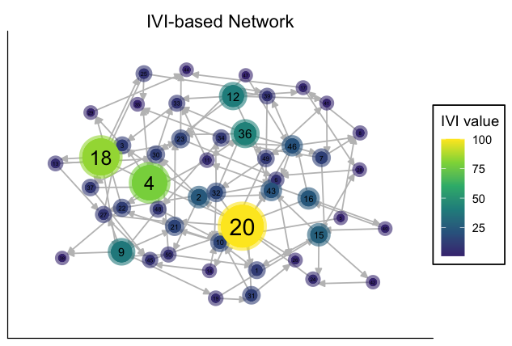
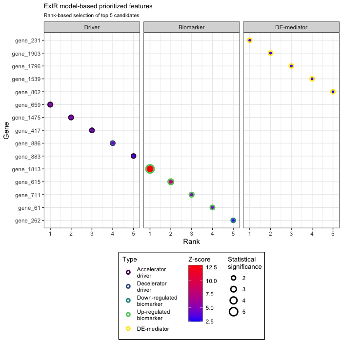

<style>
body {
text-align: justify}
</style>

```{r, include = FALSE}
knitr::opts_chunk$set(
  collapse = TRUE,
  comment = "#>"
)
options(tibble.print_min = 4L, tibble.print_max = 4L)
options(width=90)
options(rmarkdown.html_vignette.check_title = FALSE)
set.seed(60)
```

```{r, echo=FALSE}
spaces <- function (n) {
  paste(rep("&nbsp;", n), collapse = "")
}
```

# Overview 

```{r fig.align="right", echo=FALSE, out.width="25%", out.extra='style="float:right; padding:10px"'}
knitr::include_graphics(path = "../man/figures/Symbol.png", error = FALSE)
```

`influential` is an R package mainly for the identification of the most influential nodes in a network as well as the classification and ranking of top candidate features. The `influential` package contains several functions that could be categorized into five groups according to their purpose:

* Network reconstruction
* Calculation of centrality measures
* Assessment of the association of centrality measures
* Identification of the most `influential` network nodes
* Experimental data-based classification and ranking of features

The sections below introduce these five categories. However, if you wish not going through all of the functions and their applications, you may skip to any of the novel methods proposed by the `influential`, including: 

* [ExIR](#ExIR)
* [IVI](#IVI)
* [Hubness score](#HubnessScore)
* [Spreading score](#SpreadingScore)
* [SIRIR](#SIRIR)
* [Computational manipulation](#CompManipulate)

********

```{r setup}
library(influential)
```

# Fase correlation analysis

Correlation (association/similarity/dissimilarity) analysis is the first required step before network reconstructions. Although R base `cor` function makes it possible to perform correlation analysis of a table, this function is notably slow in the correlation analysis of large datasets. Also, calculation of probability values is not possible for all correlations between all pairs of features simultaneously. The `fcor` function calculates Pearson/Spearman correlations between all pairs of features in a matrix/dataframe much faster than the base R cor function. It is also possible to simultaneously calculate mutual rank (MR) of correlations as well as their p-values and adjusted p-values. Additionally, this function can automatically combine and flatten the result matrices. Selecting correlated features using an MR-based threshold rather than based on their correlation coefficients or an arbitrary p-value is more efficient and accurate in inferring functional associations in systems, for example in gene regulatory networks. 

Here is an example of performing correlation analysis using the `fcor` function.

```{r exptl_data_fcor, eval=FALSE}

# Prepare a sample dataset
set.seed(60)
my_data <- matrix(data = runif(n = 10000, min = 2, max = 300), 
                       nrow = 50, ncol = 200, 
                       dimnames = list(c(paste("sample", c(1:50), sep = "_")), 
                                       c(paste("gene", c(1:200), sep = "_")))
)
```

Have a look at top 5 samples and gene (rows and columns) of the `my_data`:  

|         |    gene_1|    gene_2|    gene_3|    gene_4|    gene_5|
|:--------|---------:|---------:|---------:|---------:|---------:|
|sample_1 | 229.80194| 202.09477| 286.98031| 212.86299| 255.15716|
|sample_2 | 107.12704| 262.56776|  92.47135| 263.67454| 188.00376|
|sample_3 | 208.04590| 123.99512| 284.35705| 173.80360| 270.60758|
|sample_4 | 209.36913| 141.90713| 154.59261| 130.17074| 219.54511|
|sample_5 |  86.21945|  14.10478| 258.05186|  40.89961|  18.83074|

```{r fcor_calc, eval=FALSE}

# Calculate correlations between all pairs of genes

correlation_tbl <- fcor(data = my_data, 
                        method = "spearman", 
                        mutualRank = TRUE,
                        pvalue = "TRUE", adjust = "BH",
                        flat = TRUE)
```

Now have a look at the top 10 rows of the `correlation_tbl`:  

|row    |column |        cor|         mr|         p|     p.adj|
|:------|:------|----------:|----------:|---------:|---------:|
|gene_1 |gene_2 |  0.3373349|   3.872983| 0.0165899| 0.8096184|
|gene_1 |gene_3 |  0.0721729| 122.270193| 0.6184265| 0.9981266|
|gene_2 |gene_3 |  0.0002401| 200.000000| 0.9986797| 0.9995793|
|gene_1 |gene_4 | -0.0636255| 132.864593| 0.6606863| 0.9981266|
|gene_2 |gene_4 |  0.0124370| 182.931681| 0.9316877| 0.9981266|
|gene_3 |gene_4 | -0.0945498| 108.958708| 0.5136765| 0.9981266|
|gene_1 |gene_5 | -0.0616086| 136.167177| 0.6708188| 0.9981266|
|gene_2 |gene_5 | -0.1063625|  90.862533| 0.4622400| 0.9981266|
|gene_3 |gene_5 |  0.2174790|  25.922963| 0.1292321| 0.9700054|
|gene_4 |gene_5 |  0.0341417| 171.499271| 0.8139135| 0.9981266|

<a href="#top">Back to top</a>

# Network reconstruction

Three functions have been obtained from the `igraph`^[Csardi G., Nepusz T. *The igraph software package for complex network research*.
InterJournal. 2006; (1695).] R package for the reconstruction of networks.

## From a data frame
In the data frame the first and second columns should be composed of source and target nodes.  
A sample appropriate data frame is brought below:
    
```{r, echo=FALSE}
knitr::kable(head(coexpression.data))
```
    
This is a co-expression dataset obtained from a paper by Salavaty **et al**.^[Salavaty A, Rezvani Z, Najafi A. *Survival analysis and functional annotation of long non-coding RNAs in lung adenocarcinoma*. J Cell Mol Med. 2019;23:5600–5617. ([PMID: 31211495](https://pubmed.ncbi.nlm.nih.gov/31211495/))]

```{r g_dataframe}
# Preparing the data
MyData <- coexpression.data

# Reconstructing the graph
My_graph <- graph_from_data_frame(d=MyData)
```

If you look at the class of `My_graph` you should see that it has an `igraph` class:
```{r}
class(My_graph)
```

## From an adjacency matrix
A sample appropriate adjacency matrix is brought below: 

```{r, echo=FALSE}
knitr::kable(head(coexpression.adjacency, n=15)[10:15,10:15])
```
  
+ Note that the matrix has the same number of rows and columns.

```{r g_adj, eval=FALSE}
# Preparing the data
MyData <- coexpression.adjacency        

# Reconstructing the graph
My_graph <- graph_from_adjacency_matrix(MyData)        
```

## From an incidence matrix
A sample appropriate incidence matrix is brought below: 
```{r, echo=FALSE}
set.seed(60)
My_Data <- matrix(data = sample(c(0,1), replace = TRUE, size = 20), 
                  nrow = 4, ncol = 5,
                  dimnames = list(c(paste("cell", c(1:4), sep = "_")),
                                  c(paste("Gene", c(1:5), sep = "_"))))

knitr::kable(My_Data)
```

```{r g_inc, eval=FALSE}
# Reconstructing the graph
My_graph <- graph_from_adjacency_matrix(MyData)        
```

## From a SIF file
SIF is the common output format of the Cytoscape software.

```{r g_sif, eval=FALSE}
# Reconstructing the graph
My_graph <- sif2igraph(Path = "Sample_SIF.sif")        

class(My_graph)
#> [1] "igraph"
```

<a href="#top">Back to top</a>

# Calculation of centrality measures
To calculate the centrality of nodes within a network several different options are available. The following sections describe how to obtain the names of network nodes and use different functions to calculate the centrality of nodes within a network. Although several centrality functions are provided, we recommend the [IVI](#IVI) for the identification of the most `influential` nodes within a network.

> By the way, the results of all of the following centrality functions could be conveniently illustrated using the [centrality-based network visualization function](#NetVis).

## Network vertices
Network vertices (nodes) are required in order to calculate their centrality measures.
Thus, before calculation of network centrality measures we need to obtain the name of required network vertices. To this end, we use the `V` function, which is obtained from the `igraph` package. However, you may provide a character vector of the name of your desired nodes manually.

+ Note in many of the centrality index functions the entire network nodes are assessed if no vector of desired vertices is provided.

```{r Vertices, eval=FALSE}
# Preparing the data
MyData <- coexpression.data        

# Reconstructing the graph
My_graph <- graph_from_data_frame(MyData)        

# Extracting the vertices
My_graph_vertices <- V(My_graph)        

head(My_graph_vertices)
#> + 6/794 vertices, named, from 775cff6:
#> [1] ADAMTS9-AS2 C8orf34-AS1 CADM3-AS1   FAM83A-AS1  FENDRR      LANCL1-AS1
```

## Degree centrality
Degree centrality is the most commonly used local centrality measure which could be calculated
via the `degree` function obtained from the `igraph` package.

```{r DC, eval=FALSE}
# Preparing the data
MyData <- coexpression.data        

# Reconstructing the graph
My_graph <- graph_from_data_frame(MyData)        

# Extracting the vertices
GraphVertices <- V(My_graph)        

# Calculating degree centrality
My_graph_degree <- degree(My_graph, v = GraphVertices, normalized = FALSE) 

head(My_graph_degree)
#> ADAMTS9-AS2 C8orf34-AS1   CADM3-AS1  FAM83A-AS1      FENDRR  LANCL1-AS1 
#>         172         121         168          26         189         176
```

Degree centrality could be also calculated for *directed* graphs via specifying the `mode` parameter.

## Betweenness centrality
Betweenness centrality, like degree centrality, is one of the most commonly used centrality measures but is representative of the global centrality of a node. This centrality metric could also be  calculated using a function obtained from the `igraph` package.

```{r BC, eval=FALSE}
# Preparing the data
MyData <- coexpression.data        

# Reconstructing the graph
My_graph <- graph_from_data_frame(MyData)        

# Extracting the vertices
GraphVertices <- V(My_graph)        

# Calculating betweenness centrality
My_graph_betweenness <- betweenness(My_graph, v = GraphVertices,    
                                    directed = FALSE, normalized = FALSE)

head(My_graph_betweenness)
#> ADAMTS9-AS2 C8orf34-AS1   CADM3-AS1  FAM83A-AS1      FENDRR  LANCL1-AS1 
#>   21719.857   28185.199   26946.625    2940.467   33333.369   21830.511
```

Betweenness centrality could be also calculated for *directed* and/or *weighted* graphs via specifying the `directed` and `weights` parameters, respectively.

## Neighborhood connectivity

Neighborhood connectivity is one of the other important centrality measures that reflect the semi-local centrality of a node. This centrality measure was first represented in a Science paper^[Maslov S., Sneppen K. *Specificity and stability in topology of protein networks*. Science. 2002; 296: 910-913 ([PMID:11988575 ](https://pubmed.ncbi.nlm.nih.gov/11988575/))] in 2002 and is for the first time calculable in R environment via the `influential` package.

```{r NC, eval=FALSE}
# Preparing the data
MyData <- coexpression.data        

# Reconstructing the graph
My_graph <- graph_from_data_frame(MyData)        

# Extracting the vertices
GraphVertices <- V(My_graph)        

# Calculating neighborhood connectivity
neighrhood.co <- neighborhood.connectivity(graph = My_graph,    
                                           vertices = GraphVertices,
                                           mode = "all")

head(neighrhood.co)
#>  ADAMTS9-AS2 C8orf34-AS1   CADM3-AS1  FAM83A-AS1      FENDRR  LANCL1-AS1 
#>   11.290698    4.983471    7.970238    3.000000   15.153439   13.465909
```

Neighborhood connectivity could be also calculated for *directed* graphs via specifying the `mode` parameter.

## H-index

H-index is H-index is another semi-local centrality measure that was inspired from its application in assessing the impact of researchers and is for the first time calculable in R environment via the `influential` package.

```{r H_index, eval=FALSE}
# Preparing the data
MyData <- coexpression.data        

# Reconstructing the graph
My_graph <- graph_from_data_frame(MyData)        

# Extracting the vertices
GraphVertices <- V(My_graph)        

# Calculating H-index
h.index <- h_index(graph = My_graph,    
                   vertices = GraphVertices,
                   mode = "all")

head(h.index)
#> ADAMTS9-AS2 C8orf34-AS1   CADM3-AS1  FAM83A-AS1      FENDRR  LANCL1-AS1 
#>          11           9          11           2          12          12
```

H-index could be also calculated for *directed* graphs via specifying the `mode` parameter.

## Local H-index

Local H-index (LH-index) is a semi-local centrality measure and an improved version of H-index centrality that leverages the H-index to the second order neighbors of a node and is for the first time calculable in R environment via the `influential` package.

```{r LH_index, eval=FALSE}
# Preparing the data
MyData <- coexpression.data        

# Reconstructing the graph
My_graph <- graph_from_data_frame(MyData)        

# Extracting the vertices
GraphVertices <- V(My_graph)        

# Calculating Local H-index
lh.index <- lh_index(graph = My_graph,    
                   vertices = GraphVertices,
                   mode = "all")

head(lh.index)
#> ADAMTS9-AS2 C8orf34-AS1   CADM3-AS1  FAM83A-AS1      FENDRR  LANCL1-AS1 
#>        1165         446         994          34        1289        1265
```

Local H-index could be also calculated for *directed* graphs via specifying the `mode` parameter.

## Collective Influence

Collective Influence (CI) is a global centrality measure that calculates the product of the reduced degree (degree - 1) of a node and the total reduced degree of all nodes at a distance d from the node. This centrality measure is for the first time provided in an R package.

```{r CI, eval=FALSE}
# Preparing the data
MyData <- coexpression.data        

# Reconstructing the graph
My_graph <- graph_from_data_frame(MyData)        

# Extracting the vertices
GraphVertices <- V(My_graph)        

# Calculating Collective Influence
ci <- collective.influence(graph = My_graph,    
                          vertices = GraphVertices,
                          mode = "all", d=3)

head(ci)
#> ADAMTS9-AS2 C8orf34-AS1   CADM3-AS1  FAM83A-AS1      FENDRR  LANCL1-AS1 
#>        9918       70560       39078         675       10716        7350
```

Collective Influence could be also calculated for *directed* graphs via specifying the `mode` parameter.

## ClusterRank

ClusterRank is a local centrality measure that makes a connection between local and semi-local characteristics of a node and at the same time removes the negative effects of local clustering.

```{r CR, eval=FALSE}
# Preparing the data
MyData <- coexpression.data        

# Reconstructing the graph
My_graph <- graph_from_data_frame(MyData)        

# Extracting the vertices
GraphVertices <- V(My_graph)        

# Calculating ClusterRank
cr <- clusterRank(graph = My_graph,    
                  vids = GraphVertices,
                  directed = FALSE, loops = TRUE)

head(cr)
#> ADAMTS9-AS2 C8orf34-AS1   CADM3-AS1  FAM83A-AS1      FENDRR  LANCL1-AS1 
#>   63.459812    5.185675   21.111776    1.280000  135.098278   81.255195
```

ClusterRank could be also calculated for *directed* graphs via specifying the `directed` parameter.

<a href="#top">Back to top</a>

# Assessment of the association of centrality measures

## Conditional probability of deviation from means

The function `cond.prob.analysis` assesses the conditional probability of deviation of two
centrality measures (or any other two continuous variables) from their corresponding means in opposite directions.

```{r cond.prob}
# Preparing the data
MyData <- centrality.measures        

# Assessing the conditional probability
My.conditional.prob <- cond.prob.analysis(data = MyData,       
                                          nodes.colname = rownames(MyData),
                                          Desired.colname = "BC",
                                          Condition.colname = "NC")

print(My.conditional.prob)
```

- As you can see in the results, the whole data is also randomly splitted into half in order 
to further test the validity of conditional probability assessments.
- *The higher the conditional probability the more two centrality measures behave in contrary manners*.

## Nature of association (considering dependent and independent)

The function `double.cent.assess` could be used to automatically assess both the distribution
mode of centrality measures (two continuous variables) and the nature of their association. The analyses done through this formula are as follows:

1. **Normality assessment**:
    - Variables with **lower than** 5000 observations: *Shapiro-Wilk test*
    - Variables with **over** 5000 observations: *Anderson-Darling test*
    <br><br>
2. **Assessment of non-linear/non-monotonic correlation**:
    - *Non-linearity assessment*: Fitting a generalized additive model (GAM) with integrated smoothness approximations 
    using the `mgcv` package
        <br><br>
    - *Non-monotonicity assessment*: Comparing the squared coefficients of the correlation based on Spearman's rank 
    correlation analysis and ranked regression test with non-linear splines.
        - Squared coefficient of Spearman's rank correlation **>** R-squared ranked regression with non-linear splines: *Monotonic*
        - Squared coefficient of Spearman's rank correlation **<** R-squared ranked regression with non-linear splines: *Non-monotonic*
    <br><br>
3. **Dependence assessment**:
    - *Hoeffding’s independence test*: Hoeffding's test of independence is a test based on the population 
    measure of deviation from independence which computes a D Statistics ranging from -0.5 to 1: Greater D values 
    indicate a higher dependence between variables.
    - *Descriptive non-linear non-parametric dependence test*: This assessment is based on non-linear non-parametric 
    statistics (NNS) which outputs a dependence value ranging from 0 to 1. For further details please refer to the NNS R package^[NNS: Nonlinear Nonparametric Statistics. ([CRAN](https://cran.r-project.org/package=NNS))]: Greater values indicate a higher dependence between variables.
        <br><br>
4. **Correlation assessment**:
As the correlation between most of the centrality measures follows a non-monotonic form, this part of the assessment
is done based on the NNS statistics which itself calculates the correlation based on partial moments and outputs a correlation value ranging from -1 to 1. For further details please refer to the NNS R package.
        <br><br>
5. **Assessment of conditional probability of deviation from means**
This step assesses the conditional probability of deviation of two centrality measures (or any other two continuous variables) from their corresponding means in opposite directions.
    - The independent centrality measure (variable) is considered as the condition variable and the other as the desired one.
    - As you will see in the results, the whole data is also randomly splitted into half in order 
to further test the validity of conditional probability assessments.
    - *The higher the conditional probability the more two centrality measures behave in contrary manners*.

```{r double.cent.assess, eval=FALSE}
# Preparing the data
MyData <- centrality.measures        

# Association assessment
My.metrics.assessment <- double.cent.assess(data = MyData,       
                                            nodes.colname = rownames(MyData),
                                            dependent.colname = "BC",
                                            independent.colname = "NC")

print(My.metrics.assessment)
#> $Summary_statistics
#>         BC NC
#> Min.              0.000000000                   1.2000
#> 1st Qu.           0.000000000                  66.0000
#> Median            0.000000000                 156.0000
#> Mean              0.005813357                 132.3443
#> 3rd Qu.           0.000340000                 179.3214
#> Max.              0.529464720                 192.0000
#> 
#> $Normality_results
#>                               p.value
#> BC    1.415450e-50
#> NC 9.411737e-30
#> 
#> $Dependent_Normality
#> [1] "Non-normally distributed"
#> 
#> $Independent_Normality
#> [1] "Non-normally distributed"
#> 
#> $GAM_nonlinear.nonmonotonic.results
#>      edf  p-value 
#> 8.992406 0.000000 
#> 
#> $Association_type
#> [1] "nonlinear-nonmonotonic"
#> 
#> $HoeffdingD_Statistic
#>         D_statistic P_value
#> Results  0.01770279   1e-08
#> 
#> $Dependence_Significance
#>                       Hoeffding
#> Results Significantly dependent
#> 
#> $NNS_dep_results
#>         Correlation Dependence
#> Results  -0.7948106  0.8647164
#> 
#> $ConditionalProbability
#> [1] 55.35386
#> 
#> $ConditionalProbability_split.half.sample
#> [1] 55.90331
```

**Note**: It should also be noted that as a single regression line does not fit all models with a 
certain degree of freedom, based on the size and correlation mode of the variables provided, this function might return an error due to incapability of running step 2. In this case, you may follow each step manually or as an alternative run the other function named `double.cent.assess.noRegression` which does not perform any regression test and consequently it is not required to determine the dependent and independent variables.

## Nature of association (without considering dependence direction)

The function `double.cent.assess.noRegression` could be used to automatically assess both the distribution
mode of centrality measures (two continuous variables) and the nature of their association. The analyses done through this formula are as follows:

1. **Normality assessment**:
    - Variables with **lower than** 5000 observations: *Shapiro-Wilk test*
    - Variables with **over** 5000 observations: *Anderson–Darling test*
    <br><br>
2. **Dependence assessment**:
    - *Hoeffding’s independence test*: Hoeffding's test of independence is a test based on the population 
    measure of deviation from independence which computes a D Statistics ranging from -0.5 to 1: Greater D values 
    indicate a higher dependence between variables.
    - *Descriptive non-linear non-parametric dependence test*: This assessment is based on non-linear non-parametric 
    statistics (NNS) which outputs a dependence value ranging from 0 to 1. For further details please refer to the NNS R package: Greater values indicate a higher dependence between variables.
        <br><br>
3. **Correlation assessment**:
As the correlation between most of the centrality measures follows a non-monotonic form, this part of the assessment
is done based on the NNS statistics which itself calculates the correlation based on partial moments and outputs a correlation value ranging from -1 to 1. For further details please refer to the NNS R package.
        <br><br>
4. **Assessment of conditional probability of deviation from means**
This step assesses the conditional probability of deviation of two centrality measures (or any other two continuous variables) from their corresponding means in opposite directions.
    - The `centrality2` variable is considered as the condition variable and the other (`centrality1`) as the desired one.
    - As you will see in the results, the whole data is also randomly splitted into half in order 
to further test the validity of conditional probability assessments.
    - *The higher the conditional probability the more two centrality measures behave in contrary manners*.

```{r double.cent.assess.noRegr., eval=FALSE}
# Preparing the data
MyData <- centrality.measures        

# Association assessment
My.metrics.assessment <- double.cent.assess.noRegression(data = MyData,       
                                                         nodes.colname = rownames(MyData),
                                                         centrality1.colname = "BC",
                                                         centrality2.colname = "NC")

print(My.metrics.assessment)
#> $Summary_statistics
#>         BC NC
#> Min.              0.000000000                   1.2000
#> 1st Qu.           0.000000000                  66.0000
#> Median            0.000000000                 156.0000
#> Mean              0.005813357                 132.3443
#> 3rd Qu.           0.000340000                 179.3214
#> Max.              0.529464720                 192.0000
#> 
#> $Normality_results
#>                               p.value
#> BC    1.415450e-50
#> NC 9.411737e-30
#> 
#> $Centrality1_Normality
#> [1] "Non-normally distributed"
#> 
#> $Centrality2_Normality
#> [1] "Non-normally distributed"
#> 
#> $HoeffdingD_Statistic
#>         D_statistic P_value
#> Results  0.01770279   1e-08
#> 
#> $Dependence_Significance
#>                       Hoeffding
#> Results Significantly dependent
#> 
#> $NNS_dep_results
#>         Correlation Dependence
#> Results  -0.7948106  0.8647164
#> 
#> $ConditionalProbability
#> [1] 55.35386
#> 
#> $ConditionalProbability_split.half.sample
#> [1] 55.68163
```

<a href="#top">Back to top</a>

# Identification of the most `influential` network nodes {#IVI}

**IVI**
    : `IVI` is the first integrative method for the identification of network most influential
    nodes in a way that captures all network topological dimensions. The `IVI` formula integrates the most important local (i.e. degree centrality and ClusterRank), semi-local (i.e. neighborhood connectivity and local H-index) and global (i.e. betweenness centrality and collective influence) centrality measures in such a way that both synergizes their effects and removes their biases.

## Integrated Value of Influence (IVI) from centrality measures

```{r IVI.from.indices, eval=FALSE}
# Preparing the data
MyData <- centrality.measures        

# Calculation of IVI
My.vertices.IVI <- ivi.from.indices(DC = MyData$DC,       
                                   CR = MyData$CR,
                                   NC = MyData$NC,
                                   LH_index = MyData$LH_index,
                                   BC = MyData$BC,
                                   CI = MyData$CI)

head(My.vertices.IVI)
#> [1] 24.670056  8.344337 18.621049  1.017768 29.437028 33.512598
```

## Integrated Value of Influence (IVI) from a graph

```{r IVI, eval=FALSE}
# Preparing the data
MyData <- coexpression.data        

# Reconstructing the graph
My_graph <- graph_from_data_frame(MyData)        

# Extracting the vertices
GraphVertices <- V(My_graph)        

# Calculation of IVI
My.vertices.IVI <- ivi(graph = My_graph, vertices = GraphVertices, 
                       weights = NULL, directed = FALSE, mode = "all",
                       loops = TRUE, d = 3, scaled = TRUE)

head(My.vertices.IVI)
#> ADAMTS9-AS2 C8orf34-AS1   CADM3-AS1  FAM83A-AS1      FENDRR  LANCL1-AS1 
#>    39.53878    19.94999    38.20524     1.12371   100.00000    47.49356
```

IVI could be also calculated for *directed* and/or *weighted* graphs via specifying the `directed`, `mode`, and `weights` parameters.

Check out [our paper](https://doi.org/10.1016/j.patter.2020.100052)^[Salavaty A, Ramialison M, Currie PD. *Integrated Value of Influence: An Integrative Method for the Identification of the Most Influential Nodes within Networks*. Patterns. 2020.08.14. ([Read online](https://doi.org/10.1016/j.patter.2020.100052))] for a more complete description of the IVI formula and all of its underpinning methods and analyses.

The following tutorial video demonstrates how to simply calculate the IVI value of 
all of the nodes within a network.  

<iframe width="100%" height="400" src="https://www.youtube.com/embed/nF9qe4dvuJc" frameborder="0" allow="accelerometer; clipboard-write; encrypted-media; gyroscope; picture-in-picture" allowfullscreen data-external="1"></iframe> 

## Network visualization {#NetVis}
The `cent_network.vis` is a function for the visualization of a network based on applying a centrality measure to the size and color of network nodes. The centrality of network nodes could be calculated by any means and based on any centrality index. Here, we demonstrate the visualization of a network according to [IVI](#IVI) values.

```{r net.for.vis, eval=FALSE}
# Reconstructing the graph
set.seed(70)
My_graph <-  igraph::sample_gnm(n = 50, m = 120, directed = TRUE)

# Calculating the IVI values
My_graph_IVI <- ivi(My_graph, directed = TRUE)

# Visualizing the graph based on IVI values
My_graph_IVI_Vis <- cent_network.vis(graph = My_graph,
                                     cent.metric = My_graph_IVI,
                                     directed = TRUE,
                                     plot.title = "IVI-based Network",
                                     legend.title = "IVI value")

My_graph_IVI_Vis
```



The above figure illustrates a simple use case of the function `cent_network.vis`. You can apply this function to directed/undirected and/or weighted/unweighted networks. Also, a complete flexibility (list of arguments) have been provided for the adjustment of colors, transparencies, sizes, titles, etc. Additionally, several different layouts have been provided that could be conveniently applied to a network. 

> In the case of highly crowded networks, the "**grid**" layout would be most appropriate.

The following tutorial video demonstrates how to visualize a network based on the centrality of nodes (e.g. their `IVI` values).

<iframe width="100%" height="400" src="https://www.youtube.com/embed/kCmEdOoIUD4" frameborder="0" allow="accelerometer; clipboard-write; encrypted-media; gyroscope; picture-in-picture" allowfullscreen data-external="1"></iframe>

## IVI shiny app {#IVIShiny}
A shiny app has also been developed for the calculation of IVI as well as IVI-based network 
visualization, which is accessible using the following command.  
`influential::runShinyApp("IVI")`  
You can also access the shiny app online at the [Influential Software Package server](https://influential.erc.monash.edu/).

<a href="#top">Back to top</a>

# Identification of the most important network spreaders {#SpreadingScore}
Sometimes we seek to identify not necessarily the most influential nodes but the nodes
with most potential in spreading of information throughout the network.

**Spreading score**
    : `spreading.score` is an integrative score made up of four different centrality measures
    including ClusterRank, neighborhood connectivity, betweenness centrality, and 
    collective influence. Also, Spreading score reflects the spreading potential of 
    each node within a network and is one of the major components of the [`IVI`](#IVI).
    
```{r Spreading.score, eval=FALSE}
# Preparing the data
MyData <- coexpression.data        

# Reconstructing the graph
My_graph <- graph_from_data_frame(MyData)        

# Extracting the vertices
GraphVertices <- V(My_graph)        

# Calculation of Spreading score
Spreading.score <- spreading.score(graph = My_graph,     
                                   vertices = GraphVertices, 
                                   weights = NULL, directed = FALSE, mode = "all",
                                   loops = TRUE, d = 3, scaled = TRUE)

head(Spreading.score)
#> ADAMTS9-AS2 C8orf34-AS1   CADM3-AS1  FAM83A-AS1      FENDRR  LANCL1-AS1 
#>   42.932497   38.094111   45.114648    1.587262  100.000000   49.193292 
```

Spreading score could be also calculated for *directed* and/or *weighted* graphs via specifying the `directed`, `mode`, and `weights` parameters. The results could be conveniently illustrated using the [centrality-based network visualization function](#NetVis).

<a href="#top">Back to top</a>

# Identification of the most important network hubs {#HubnessScore}
In some cases we want to identify not the nodes with the most sovereignty in their 
surrounding local environments.

**Hubness score**
    : `hubness.score` is an integrative score made up of two different centrality measures
    including degree centrality and local H-index. Also, Hubness score reflects the power 
    of each node in its surrounding environment and is one of the major components of the [`IVI`](#IVI).
    
```{r Hubness.score, eval=FALSE}
# Preparing the data
MyData <- coexpression.data        

# Reconstructing the graph
My_graph <- graph_from_data_frame(MyData)        

# Extracting the vertices
GraphVertices <- V(My_graph)        

# Calculation of Hubness score
Hubness.score <- hubness.score(graph = My_graph,     
                                   vertices = GraphVertices, 
                                   directed = FALSE, mode = "all",
                                   loops = TRUE, scaled = TRUE)

head(Hubness.score)
#> ADAMTS9-AS2 C8orf34-AS1   CADM3-AS1  FAM83A-AS1      FENDRR  LANCL1-AS1 
#>   84.299719   46.741660   77.441514    8.437142   92.870451   88.734131
```

Spreading score could be also calculated for *directed* graphs via specifying the `directed` and `mode` parameters. The results could be conveniently illustrated using the [centrality-based network visualization function](#NetVis).

<a href="#top">Back to top</a>

# Ranking the influence of nodes on the topology of a network based on the `SIRIR` model {#SIRIR}

**SIRIR**
    : `SIRIR` is achieved by the integration of susceptible-infected-recovered (SIR) model with the leave-one-out cross validation technique and ranks network nodes based on their true universal influence on the network topology and spread of information. One of the applications of this function is the assessment of 
    performance of a novel algorithm in identification of network influential nodes.
    
```{r SIRIR, eval=FALSE}
# Reconstructing the graph
My_graph <-  sif2igraph(Path = "Sample_SIF.sif")       

# Extracting the vertices
GraphVertices <- V(My_graph)        

# Calculation of influence rank
Influence.Ranks <- sirir(graph = My_graph,     
                                   vertices = GraphVertices, 
                                   beta = 0.5, gamma = 1, no.sim = 10, seed = 1234)

```

|      | difference.value| rank|
|:-----|----------------:|----:|
|MRAP  |             49.7|    1|
|FOXM1 |             49.5|    2|
|ATAD2 |             49.5|    2|
|POSTN |             49.4|    4|
|CDC7  |             49.3|    5|
|ZWINT |             42.1|    6|
|MKI67 |             41.9|    7|
|FN1   |             41.9|    7|
|ASPM  |             41.8|    9|
|ANLN  |             41.8|    9|

<a href="#top">Back to top</a>

# Experimental data-based classification and ranking of top candidate features {#ExIR}

**ExIR**
    : `ExIR` is a model for the classification and ranking of top candidate features. The input data could come from any type of experiment such as transcriptomics and proteomics. This model is based on multi-level filtration and scoring based on several supervised and unsupervised analyses followed by the classification and integrative ranking of top candidate features. Using this function and depending on the input data and specified arguments, the user can get a graph object and one to four tables including:
    
+ **Drivers**: Prioritized drivers are supposed to have the highest impact on the progression of a biological process or disease under investigation.
+ **Biomarkers**: Prioritized biomarkers are supposed to have the highest sensitivity to different conditions under investigation and the severity of each condition.
+ **DE-mediators**: Prioritized DE-mediators are those features that are differentially expressed/abundant but in a fluctuating manner and play mediatory roles between drivers.
+ **nonDE-mediators**: Prioritized nonDE-mediators are those features that are not differentially expressed/abundant but have associations with and play mediatory roles between drivers.
    
First, prepare your data. Suppose we have the data for time-course transcriptomics and 
we have previously performed differential expression analysis for each step-wise pair of
time-points. Also, we have performed trajectory analysis to identify the genes that have significant alterations across all time-points.

```{r exir.data, eval=FALSE}
# Prepare sample data
gene.names <- paste("gene", c(1:2000), sep = "_")

set.seed(60)
tp2.vs.tp1.DEGs <- data.frame(logFC = rnorm(n = 700, mean = 2, sd = 4),
                              FDR = runif(n = 700, min = 0.0001, max = 0.049))

set.seed(60)
rownames(tp2.vs.tp1.DEGs) <- sample(gene.names, size = 700)

set.seed(70)
tp3.vs.tp2.DEGs <- data.frame(logFC = rnorm(n = 1300, mean = -1, sd = 5),
                              FDR = runif(n = 1300, min = 0.0011, max = 0.039))

set.seed(70)
rownames(tp3.vs.tp2.DEGs) <- sample(gene.names, size = 1300)

set.seed(80)
regression.data <- data.frame(R_squared = runif(n = 800, min = 0.1, max = 0.85))

set.seed(80)
rownames(regression.data) <- sample(gene.names, size = 800)
```

## Assembling the Diff_data
Use the function `diff_data.assembly` to automatically generate the Diff_data table for 
the `ExIR` model.

```{r diff_data_assembl, eval=FALSE}
my_Diff_data <- diff_data.assembly(tp2.vs.tp1.DEGs,
                                   tp3.vs.tp2.DEGs,
                                   regression.data)

my_Diff_data[c(1:10),]
```

Have a look at the top 10 rows of the `Diff_data` data frame:

|           | Diff_value1| Sig_value1| Diff_value2| Sig_value2| Diff_value3|
|:----------|-----------:|----------:|-----------:|----------:|-----------:|
|gene_17331 |         4.9|          0|           0|          1|           0|
|gene_12546 |         4.0|          0|           0|          1|           0|
|gene_12837 |        -0.3|          0|           0|          1|           0|
|gene_18522 |         1.4|          0|           0|          1|           0|
|gene_6260  |        -4.9|          0|           0|          1|           0|
|gene_2722  |        -4.9|          0|           0|          1|           0|
|gene_19882 |         6.3|          0|           0|          1|           0|
|gene_2790  |         3.3|          0|           0|          1|           0|
|gene_17011 |        -1.6|          0|           0|          1|           0|
|gene_8321  |         3.8|          0|           0|          1|           0|


## Preparing the Exptl_data
Now, prepare a sample normalized experimental data matrix

```{r exptl_data, eval=FALSE}
set.seed(60)
MyExptl_data <- matrix(data = runif(n = 100000, min = 2, max = 300), 
                       nrow = 50, ncol = 2000, 
                       dimnames = list(c(paste("cancer_sample", c(1:25), sep = "_"),
                                         paste("normal_sample", c(1:25), sep = "_")), 
                                       gene.names))

# Log transform the data to bring them closer to normal distribution
MyExptl_data <- log2(MyExptl_data)

MyExptl_data[c(1:5, 45:50),c(1:5)]
```

Have a look at top 5 cancer and normal samples (rows) of the `Exptl_data`:

|                 | gene_1| gene_2| gene_3| gene_4| gene_5|
|:----------------|------:|------:|------:|------:|------:|
|cancer_sample_1  |      8|      8|      8|      8|      8|
|cancer_sample_2  |      7|      8|      6|      8|      8|
|cancer_sample_3  |      8|      7|      8|      7|      8|
|cancer_sample_4  |      8|      7|      7|      7|      8|
|cancer_sample_5  |      6|      4|      8|      5|      4|
|normal_sample_20 |      8|      7|      7|      8|      8|
|normal_sample_21 |      8|      7|      8|      6|      8|
|normal_sample_22 |      8|      8|      8|      7|      6|
|normal_sample_23 |      7|      6|      8|      7|      8|
|normal_sample_24 |      8|      8|      7|      5|      7|
|normal_sample_25 |      5|      7|      8|      8|      6|

Now add the "condition" column to the Exptl_data table.
```{r condition.col, eval=FALSE}
MyExptl_data <- as.data.frame(MyExptl_data)
MyExptl_data$condition <- c(rep("C", 25), rep("N", 25))
```

## Running the `ExIR` model
Finally, prepare the other required input data for the `ExIR` model.
    
```{r ExIR, eval=FALSE}

#The table of differential/regression previously prepared
my_Diff_data

#The column indices of differential values in the Diff_data table
Diff_value <- c(1,3) 

#The column indices of regression values in the Diff_data table
Regr_value <- 5

#The column indices of significance (P-value/FDR) values in 
# the Diff_data table
Sig_value <- c(2,4) 

#The matrix/data frame of normalized experimental
# data previously prepared
MyExptl_data

#The name of the column delineating the conditions of
# samples in the Exptl_data matrix
Condition_colname <- "condition"

#The desired list of features
set.seed(60)
MyDesired_list <- sample(gene.names, size = 500)  #Optional

#Running the ExIR model
My.exir <- exir(Desired_list = MyDesired_list,
                cor_thresh_method = "mr", mr = 100,
                Diff_data = my_Diff_data, Diff_value = Diff_value,
                Regr_value = Regr_value, Sig_value = Sig_value,
                Exptl_data = MyExptl_data, Condition_colname = Condition_colname,
                seed = 60, verbose = FALSE)

names(My.exir)
#> [1] "Driver table"         "DE-mediator table"     "Biomarker table"      "Graph"

class(My.exir)
#> [1] "ExIR_Result"
```

Have a look at the heads of the output tables of ExIR:

+ **Drivers**

|          |     Score|    Z.score| Rank|   P.value|     P.adj|Type        |
|:---------|---------:|----------:|----:|---------:|---------:|:-----------|
|gene_947  |  5.774833| -0.9620144|  286| 0.8319788| 0.8817412|Accelerator |
|gene_90   | 35.813378|  0.9440501|   54| 0.1725720| 0.8817412|Decelerator |
|gene_116  | 11.060591| -0.6266121|  221| 0.7345432| 0.8817412|Decelerator |
|gene_96   |  8.687675| -0.7771830|  248| 0.7814746| 0.8817412|Accelerator |
|gene_674  | 28.826453|  0.5007021|   77| 0.3082904| 0.8817412|Decelerator |
|gene_1017 | 24.162479|  0.2047545|  100| 0.4188820| 0.8817412|Accelerator |

********

+ **Biomarkers**

|          |     Score|    Z.score| Rank|    P.value|     P.adj|Type           |
|:---------|---------:|----------:|----:|----------:|---------:|:--------------|
|gene_947  |  1.000003| -0.2050551|  269| 0.58123546| 0.5812356|Up-regulated   |
|gene_90   |  1.000007| -0.2050545|  246| 0.58123524| 0.5812356|Down-regulated |
|gene_116  |  1.000002| -0.2050552|  276| 0.58123549| 0.5812356|Down-regulated |
|gene_96   |  1.308484| -0.1644440|   70| 0.56530917| 0.5812356|Up-regulated   |
|gene_674  |  1.017092| -0.2028053|  125| 0.58035641| 0.5812356|Down-regulated |
|gene_1017 | 12.507207|  1.3098553|   12| 0.09512239| 0.5812356|Up-regulated   |

********

+ **DE-mediators**

|          |    Score|     Z.score| Rank|   P.value|     P.adj|
|:---------|--------:|-----------:|----:|---------:|---------:|
|gene_592  | 11.10698| -1.01338150|  155| 0.8445610| 0.9191820|
|gene_258  | 17.95400| -0.66579750|  133| 0.7472297| 0.9191820|
|gene_549  | 55.86578|  1.25876700|   25| 0.1040573| 0.7359122|
|gene_891  | 69.81941|  1.96711288|    9| 0.0245851| 0.4578919|
|gene_1450 | 32.99729|  0.09786426|   68| 0.4610200| 0.9191820|
|gene_742  | 28.62281| -0.12420298|   79| 0.5494227| 0.9191820|

The following tutorial video demonstrates how to run the `ExIR` model on a sample experimental data.

<iframe width="100%" height="400" src="https://www.youtube.com/embed/-08nn4_-OUE" frameborder="0" allow="accelerometer; clipboard-write; encrypted-media; gyroscope; picture-in-picture" allowfullscreen data-external="1"></iframe>

You can also [computationally simulate knockout and/or up-regulation](#CompManipulate) of the top candidate features outputted by ExIR to evaluate the impact of their manipulations on the flow of information/signaling and integrity of the network prior to taking them to your lab bench.

## ExIR visualization
The `exir.vis` is a function for the visualization of the output of the [ExIR](#ExIR) model. The function simply gets the output of the ExIR model as a single argument and returns a plot of the top 10 prioritized features of all classes. Here, we visualize the top five candidates of the results of the `ExIR` model obtained in the previous step .

```{r exir.vis, eval=FALSE}
My.exir.Vis <- exir.vis(exir.results = My.exir, 
                        n = 5,
                        y.axis.title = "Gene")

My.exir.Vis
```



However, a complete flexibility (list of arguments) has been provided for the adjustment of all of the visual features of the plot and selection of the desired classes, feature types, and the number of top candidates.

The following tutorial video demonstrates how to visualize the results of `ExIR` model.

<iframe width="100%" height="400" src="https://www.youtube.com/embed/Ie19y6PuBDg" frameborder="0" allow="accelerometer; clipboard-write; encrypted-media; gyroscope; picture-in-picture" allowfullscreen data-external="1"></iframe>

## ExIR shiny app {#ExIRShiny}
A shiny app has also been developed for Running the ExIR model, visualization of its results as well as computational simulation of knockout and/or up-regulation of its top candidate outputs, which is accessible using the following command.  
`influential::runShinyApp("ExIR")`  
You can also access the shiny app online at the [Influential Software Package server](https://influential.erc.monash.edu/).

<a href="#top">Back to top</a>

# Computational manipulation of cells {#CompManipulate}
The `comp_manipulate` is a function for the simulation of feature (gene, protein, etc.) knockout and/or up-regulation in cells. 
This function works based on the [SIRIR](#SIRIR) (SIR-based Influence Ranking) model and could be applied on the output of the [ExIR](#ExIR) model or any other independent association network. For feature (gene/protein/etc.) knockout the [SIRIR](#SIRIR) model is used to remove the feature from the network and assess its impact on the flow of information (signaling) within the network. 
On the other hand, in case of up-regulation a node similar to the desired node is added to the network with exactly the same connections (edges) as of the original node. Next, the [SIRIR](#SIRIR) model is used to evaluate the difference in the flow of information/signaling after adding (up-regulating) the desired feature/node compared with the original network. In case you are applying this function on the output of [ExIR](#ExIR) model, you may note that as the gene/protein knockout would impact on the integrity of the under-investigation network as well as the networks of other overlapping biological processes/pathways, it is recommended to select those features that simultaneously have the highest (most significant) [ExIR](#ExIR)-based rank and lowest knockout rank. In contrast, as the up-regulation would not affect the integrity of the network, you may select the features with highest (most significant) [ExIR](#ExIR)-based and up-regulation-based ranks. Altogether, it is recommended to select the features 
with the highest (most significant) [ExIR](#ExIR)-based (major drivers or mediators of the under-investigation biological process/disease) and *Up-regulation*-based (having higher impact on the signaling within the under-investigation network when up-regulated) ranks, but with the lowest *Knockout*-based rank (having the lowest disturbance to the under-investigation as well as other overlapping networks). Below is an example of running this function on the same [ExIR](#ExIR) output generated above.

```{r comp_manipulate, eval=FALSE}
# Select which genes to knockout
set.seed(60)
ko_vertices <- sample(igraph::as_ids(V(My.exir$Graph)), size = 5)

# Select which genes to up-regulate
set.seed(1234)
upregulate_vertices <- sample(igraph::as_ids(V(My.exir$Graph)), size = 5)

Computational_manipulation <- comp_manipulate(exir_output = My.exir, 
                                              ko_vertices = ko_vertices, 
                                              upregulate_vertices = upregulate_vertices,
                                              beta = 0.5, gamma = 1, no.sim = 100, seed = 1234)
```

Have a look at the heads of the output tables:

+ **Knockout**

|   |Feature_name | Rank|Manipulation_type |
|:--|:------------|----:|:-----------------|
|2  |gene_280     |    1|Knockout          |
|1  |gene_4798    |    2|Knockout          |
|4  |gene_276     |    3|Knockout          |
|3  |gene_16459   |    4|Knockout          |
|5  |gene_7535    |    5|Knockout          |

+ **Up-regulation**

|Feature_name | Rank|Manipulation_type |
|:------------|----:|:-----------------|
|gene_6433    |    1|Up-regulation     |
|gene_8426    |    1|Up-regulation     |
|gene_6687    |    1|Up-regulation     |
|gene_1274    |    1|Up-regulation     |
|gene_11555   |    1|Up-regulation     |

+ **Combined**

|   |Feature_name | Rank|Manipulation_type |
|:--|:------------|----:|:-----------------|
|2  |gene_280     |    1|Knockout          |
|1  |gene_4798    |    2|Knockout          |
|4  |gene_276     |    3|Knockout          |
|3  |gene_16459   |    4|Knockout          |
|11 |gene_6433    |    5|Up-regulation     |
|21 |gene_8426    |    5|Up-regulation     |
|31 |gene_6687    |    5|Up-regulation     |
|41 |gene_1274    |    5|Up-regulation     |
|51 |gene_11555   |    5|Up-regulation     |
|5  |gene_7535    |   10|Knockout          |

<a href="#top">Back to top</a>

# References
